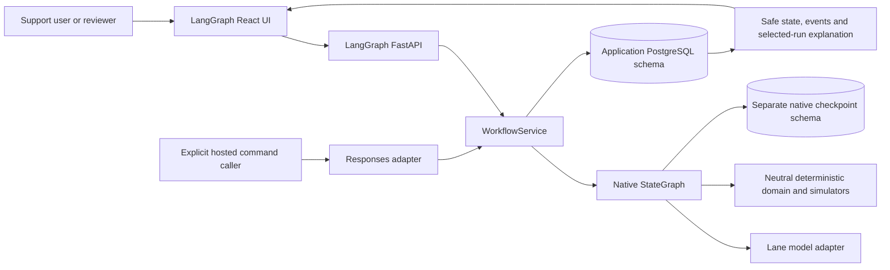
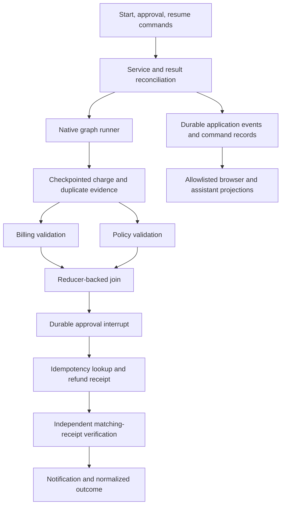
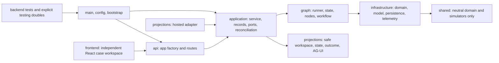
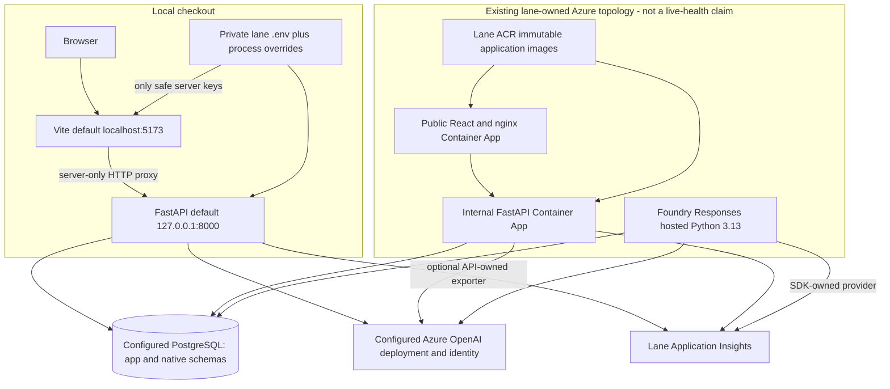

# LangGraph architecture: 4+1 views

## Purpose and scope

This document describes only the LangGraph double-charge lane: its FastAPI and
hosted command transports, native graph, independent persistence, React UI,
telemetry and deployment source. It folds the former root workflow and repository
boundary diagrams into the lane's actual implementation. The views are logical,
process, development, physical and representative scenarios (+1); they are not
an unrelated order-resolution pipeline.

Related: [requirements](prd.md), [rules](business-rules.md),
[approval rules](business-rules.md#approval-and-resume-rules), [user journey](userflow.md),
[stack/configuration](techstack.md), [source map](projectstructure.md),
[dated evidence](issues-changes-fixes.md).



## 1. Logical view

`WorkflowService` owns case command serialization, durable approval recording and
reconciliation. `DoubleChargeWorkflow` owns graph execution, routes and native
snapshot/resume. Nodes normalize a complaint, load charges, detect a duplicate,
fan out billing/policy validation, join results, interrupt for approval, submit or
recover a refund, verify it and notify/close.

The domain gateway adapts neutral fixtures/simulators. It is not a real payment
provider. The model boundary only normalizes text and drafts notifications from
allowlisted facts. Deterministic records decide eligibility and success.



No shared API, UI, service, telemetry, checkpoint codec or deployment abstraction
exists between lanes. `shared/` is limited to domain records, deterministic
simulators, fixtures and evaluation contracts. Model context, selected memory,
workflow state, audit events and native checkpoints have distinct roles.

### Schema and I/O ownership

| Store or boundary | Contents and authority |
| --- | --- |
| Application schema | Migration history, runs with safe state/outcome, ordered events, approvals, selected memory and refund receipts. |
| Native saver schema | Dependency-owned checkpoint migrations, checkpoints, blobs and writes; never browser JSON. |
| Case command API | Start request and case/run response; explicit approval and separate resume. |
| Read projections | Paginated case history, safe workspace/state/memory/outcome, persisted approval, native event replay and selected-run explanation. |
| Telemetry | Actual execution spans and safe operational metadata, not durable workflow authority. |

Default schema names are `langgraph_app_cutover` and
`langgraph_checkpoints_cutover`. Their values remain independently configurable;
they must differ. Explicit setup applies application SQL and native saver setup
separately. Runtime startup verifies both read-only and never migrates or resets
them. Old checkpoint/data conversion is not implemented.

## 2. Process view

```mermaid
sequenceDiagram
    actor Caller
    participant API as FastAPI or hosted adapter
    participant Service as WorkflowService
    participant Graph as StateGraph
    participant Audit as Application schema
    participant Saver as Native saver schema
    Caller->>API: Start case with operator identity
    API->>Service: start(request)
    Service->>Audit: Create run and native audit events
    Service->>Graph: Start on langgraph:run_id thread
    Graph->>Graph: Normalize, read, detect
    par Billing branch
        Graph->>Graph: Validate checkpointed charge evidence
    and Policy branch
        Graph->>Graph: Assess checkpointed policy evidence
    end
    Graph->>Graph: Merge reducers and join
    Graph->>Audit: Deduplicated approval-request events
    Graph->>Saver: Persist interrupt and checkpoint
    Graph-->>Service: Interrupted result
    Service->>Audit: Persist paused view, native checkpoint ID
    API-->>Caller: paused, approval_required, no terminal outcome
    Caller->>API: Approval command with checkpoint, reviewer and reason
    API->>Service: submit_approval
    Service->>Saver: Read and reconcile native snapshot
    Service->>Audit: Insert-once decision and audit event
    API-->>Caller: recorded; no refund yet
    Caller->>API: Separate Resume command with operator and checkpoint
    Service->>Audit: Read pending decision
    Service->>Saver: Check current interrupt
    Service->>Audit: Record human resume request
    Service->>Graph: Command(resume=recorded decision)
    Graph->>Audit: Validate decision and record actual continuation
    Graph->>Audit: Lookup or persist refund receipt
    Graph->>Graph: Verify matching receipt; notify only if verified
    Graph->>Saver: Persist native progress
    Service->>Audit: Persist result before consuming approval
    API-->>Caller: Current status and outcome
```

The eligible approval path is shown; denial and failure branches are detailed in
[user flow](userflow.md). A pause returns control and releases request resources;
it is never a blocking human wait. Hosted startup verifies then closes a runtime,
and each hosted command owns a fresh context that closes its audit pool, native
saver connection and model clients before responding. SDK telemetry providers
remain SDK-owned and survive these command contexts.

`validation_results` uses a dictionary reducer; `evidence` and `safe_summaries`
use list concatenation. The two validation branches write disjoint result keys.
Evidence is checkpointed and explicitly passed to the gateway so recovery does
not depend on process-local caches.

Native interrupt resume re-executes the approval node from its start; preceding
audit writes use dedupe keys. Model normalization/notification have native
two-attempt retry policies. Load and refund use bounded graph routes and durable
counters, not a lifetime retry promise. Reads of historical events do not execute
the graph; recovery does and can replay model/tool work.

Command locks serialize a case using dedicated PostgreSQL connections rather than
holding an audit-pool slot throughout execution. Application and saver writes
are not one transaction. Snapshot reconciliation, insert-once decisions,
fingerprinted receipts and verification protect specific crash windows; a
checkpoint is not an exactly-once side-effect guarantee. Real-provider
reconciliation and automatic worker recovery remain outside this demo.

### Event and telemetry flow

Native durable events feed the technical timeline, business audit, AG-UI and
selected-run explanation. The workspace follows committed `audit` SSE frames
and independent `snapshot` frames. Only audit frames advance the replay cursor;
snapshots can arrive after terminal events as outcome and memory writes finish.
Per-run event-write locking precedes sequence allocation and lasts through commit,
so concurrent branches cannot strand an earlier event behind a reader's cursor.
Sequence gaps are valid. Neither browser nor CopilotKit is a command authority.

New version-2 event data records human/system actor metadata and immutable
terminal facts. `resume_command_recorded` is human intent; version-2 `run_resumed`
records validated native continuation. Historical `run_resumed` records retain
their older dispatch meaning and are not proof that execution continued.
`human_approval_resolved` is the system applying a recorded human decision.
Verification evidence explicitly records success and matching receipt facts;
count alone does not prove a correct refund. The audit labels notifications as
simulated, not delivered to a real customer.

New runs retain the bounded original customer complaint in application JSON for
selected-case context. Legacy missing complaint/actor facts remain unknown;
history is neither deleted nor backfilled from model text. Complaint and human
audit metadata are excluded from selected-run model facts and general telemetry.

Native telemetry follows HTTP/`foundry.responses.invoke` -> `workflow.run` ->
executing nodes -> actual tools/models. Real LangChain graph/route callback spans
may be intervening ancestors. No span is synthesized from audit timestamps.
Complete native retention, content capture opt-outs and actual hosted transport
instrumentor state are validated. Only API-installed providers are flushed/closed;
the hosted SDK's providers are neither replaced nor owned.

## 3. Development view



All modules are under this lane. See [project structure](projectstructure.md)
for the exact package and seven-document map. Application SQL is packaged in
wheels under `infrastructure/persistence/sql`; hosted preparation creates ignored
copied packages and a hash manifest, not a second source tree to edit.

Tests explicitly disable dotenv/telemetry and inject fake models. Integration
checks require a dedicated loopback PostgreSQL URL and randomized schema pairs.
Configuration and frontend tests cover precedence, CWD independence, missing
settings, bind/proxy ports, secret isolation and telemetry safety. The lane's
release/evaluation/package scripts remain separate from other implementations;
dependency manifests and hosted pins were not upgraded by this change.

## 4. Physical view

The optional [lane-owned Compose stack](../../compose.yaml) provides PostgreSQL
on loopback port 25432 with its own network and persistent volume.
[Local database commands](../../README.md#local-postgresql) use a separate private
`.env.compose` and explicit wrapper; the normal Azure-backed `.env` is unchanged.
Application and native saver schemas remain separate within the selected database.



Application containers/local development use Python 3.12; the hosted adapter uses
the existing pinned Python 3.13 Responses 2.0 stack. Azure identity authenticates
real model calls. Installed packages/hosted copies default to process environment;
checkout settings select only the lane-root `.env`. No root/neighbor dotenv is
searched. Vite never publishes lane settings into `import.meta.env`.

`infra/main.bicep` currently manages only the two Container Apps and references
existing Foundry account/project/model, PostgreSQL, ACR, identities, managed
environment and Application Insights. It does not provision foundations or
rewrite monitoring/RBAC/firewalls on an application update. Existing public
service access and small-database constraints are teaching tradeoffs, not a
production network design. nginx proxies `/api`, `/health` and `/ready`.

The [ledger](issues-changes-fixes.md) records the dated September 10 API/frontend
and hosted-v15 acceptance. Later source corrections and this local configuration
work are not new deployments or evidence of present Azure health.

## 5. Scenarios (+1)

The [business scenarios](business-rules.md) explain the six demo choices.
This technical map also covers internal safety paths and regression fixtures.

| Scenario | Native path and evidence |
| --- | --- |
| Verified refund | Parallel valid evidence -> interrupt -> explicit approve/resume -> receipt -> matching verification -> notification. `test_workflow.py`, `test_postgres_integration.py`. |
| No duplicate | `detect_duplicate` -> `close_no_duplicate`; no approval/refund. `test_workflow.py`, shared fixture contract. |
| Ineligible policy | Valid billing plus explicit ineligibility -> `close_policy_ineligible`; not a technical failure. `test_workflow.py`. |
| Human pause | Paused result has a native checkpoint and null outcome; approval alone creates no refund. `test_checkpointing.py`, `test_api_and_projection.py`. |
| Denial | Recorded deny followed by resume -> `close_denied`, no notification/refund. `test_workflow.py`, `test_hosted_adapter.py`. |
| Retry and reconstruction | Uncertain receipt is recovered by the original fingerprint/key; a fresh gateway validates checkpointed evidence. `test_idempotency.py`, `test_postgres_integration.py`. |
| Failed read/validation | Exhausted reads or invalid required evidence fail explicitly, not no-refund success. `test_workflow.py`. |
| Verification/uncertainty | Count/ID mismatch or exhausted uncertainty -> manual review; never a success message. `test_workflow.py`, contract tests. |
| Missing configuration | Real bootstrap/setup fail before connections; full fake injection remains valid. `unit/test_config.py`, `unit/test_telemetry_config.py`. |

The seven-scenario evaluation/harness contract compares normalized outcomes,
not framework IDs or checkpoint payloads. Documentation describes the implemented
routes; historical release evidence and remaining limits are kept separate.

Native semantics references:
[LangGraph persistence](https://docs.langchain.com/oss/python/langgraph/persistence)
and [interrupts](https://docs.langchain.com/oss/python/langgraph/interrupts).
