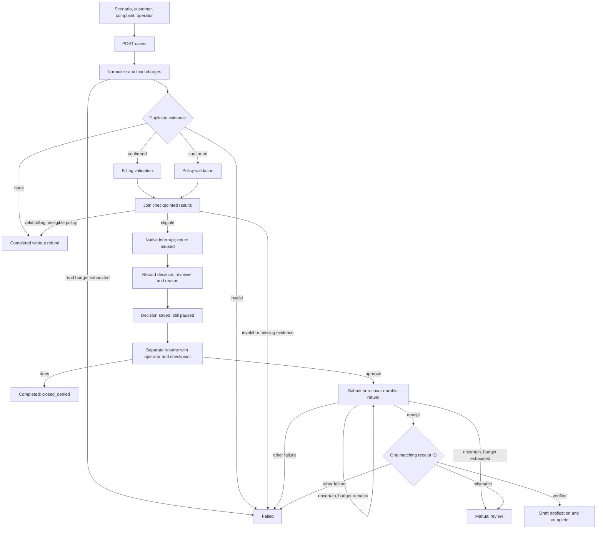
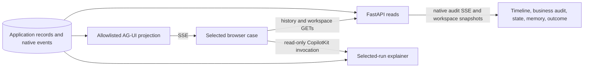

# LangGraph user flow

Related: [requirements](prd.md), [business rules](business-rules.md),
[approval rules](business-rules.md#approval-and-resume-rules).

## Current browser journey

The workspace has three panes:

| Pane | Purpose |
| --- | --- |
| Left | Persisted cases, newest first, ten at a time with **Load more**. |
| Middle | New-case form or selected context, approval/resume controls, live execution timeline, state/memory/outcome and graph/explainer inspection. |
| Right | High-level business audit with recorded human/system actors and safe supporting evidence. |

Choose **New case**, select one of six scenarios, and enter customer, complaint
and operator identity. Start sends `POST /api/cases` with a client-selected case
ID. Once the backend commits that case, observation can begin while the Start
request is still executing. A temporary pre-creation 404 does not trigger another
Start command.

Selecting history or restoring a case URL loads persisted context and evidence;
it does not replay the workflow. New cases retain the original complaint.
Historical missing complaint or actor data is shown as not recorded, never
reconstructed from a model summary.

The timeline follows `/api/cases/{case_id}/events/stream`. Native `audit` frames
carry sequence IDs for replay/deduplication; independent `snapshot` frames update
the workspace without moving that cursor. Observation continues after a terminal
event because the final state/outcome/memory write may arrive later. Connection
and malformed-stream errors are visible; AG-UI is not the source of business truth.

At a finalized approval checkpoint, enter reviewer identity and a required reason,
then record approval or denial. **The case remains paused.** Enter a Resume
operator and select Resume separately. Denial closes without refund; approval
proceeds to submission and verification. Opening a case restores its recorded
decision but does not silently reuse a previous operator or trigger Resume.

The right pane separates refund recording/recovery from successful verification,
and simulated notification from actual delivery. Version-2 terminal milestones
use their own recorded outcome facts rather than the latest workspace snapshot.
Native technical events remain in the middle timeline.

## Observation is not a command

The **Explain selected run** control uses CopilotKit's supported `useAgent`
binding and the read-only selected-run runtime. The backend validates thread/run
identifiers, ignores arbitrary messages/state/tools/context, and builds a response
from durable safe summaries. It cannot start, approve or resume the workflow.

## States and practical limits

Application states are `running`, `paused`, `completed`, `failed`, and
`manual_review`. Detailed business terminal statuses live in `outcome`, which is
null while awaiting approval. Connection errors are not business failures.
Selected memory is retained at terminal completion, not at the approval pause.
For a fresh paused case, `selected_memory: {}` alongside a durable checkpoint and
null outcome is expected; it is not a reason to replay or repair the case.
Command errors retain the selected case and direct the user to persisted evidence.
Never retry an ambiguous mutating command automatically or infer approval from
an explanation. Case selection and live responses must remain isolated so a late
response for another case cannot overwrite the current view.

The identities entered in the demo are caller assertions, not authenticated
principals. Completed, failed and manual-review runs have no active approval or
resume action; a previous decision remains read-only history. Manual review is
an escalation outcome, not an implemented reconciliation console. Its retained
regression fixture is not a normal demo choice.

Sources: `frontend/src/App.tsx`, the lane's history/workspace hooks and
`frontend/src/api.ts`, `api/routes.py` and `projections/workspace.py`.
