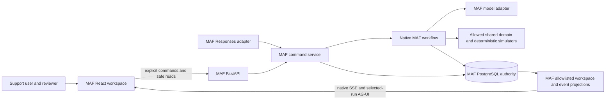
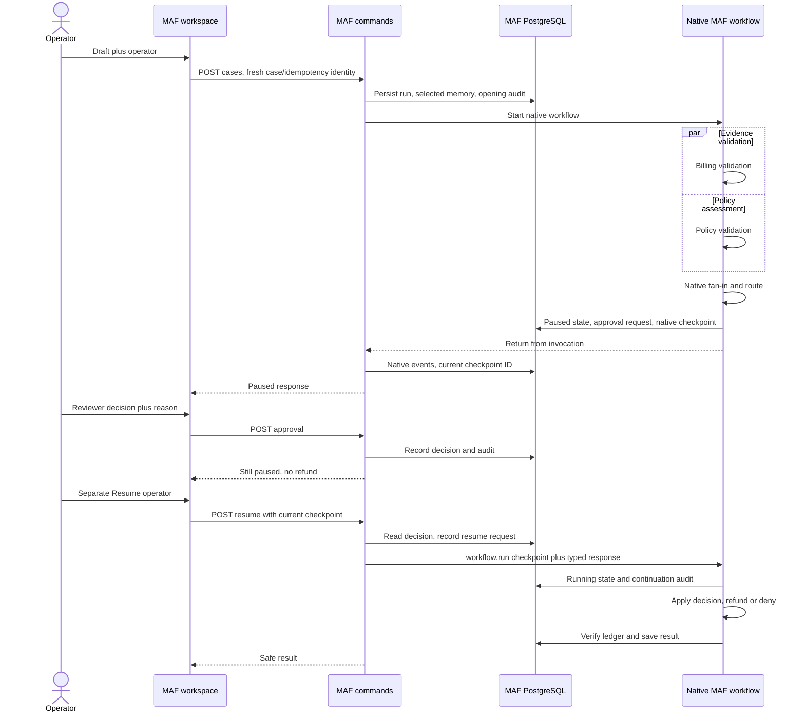
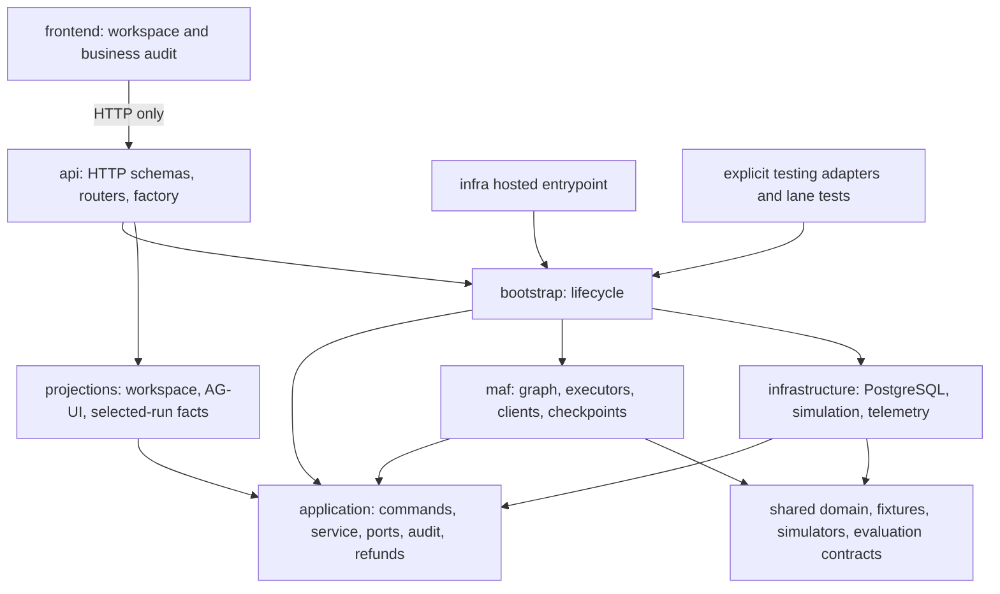
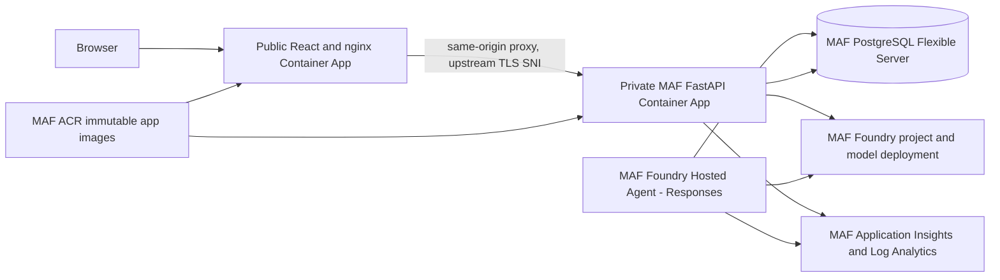

# MAF architecture: 4+1 views

## Purpose and scope

MAF carries a simulated double-charge complaint through deterministic evidence,
human control and verified resolution. This design owns only this lane's API, UI,
workflow, storage, telemetry and deployment. It incorporates the useful workflow
and repository-boundary views previously in root `docs/diagrams/`; there is no
shared implementation diagram or cross-lane runtime dependency.

Related: [requirements](prd.md), [business rules](business-rules.md),
[human approval](business-rules.md#approval-and-resume-rules), [user flow](userflow.md),
[stack](techstack.md), [source map](projectstructure.md) and
[historical/current evidence](issues-changes-fixes.md).

## 1. Logical view

| Responsibility | Owner and boundary |
| --- | --- |
| Intake/command validation | `application/commands.py`, `application/service.py`; explicit operator/reviewer intent, current checkpoint and conflict checks. |
| Investigation | Native normalization, account read and duplicate executors; model prose does not establish charge evidence. |
| Billing/policy | Two deterministic validations; native fan-out/fan-in joins both before routing. |
| Human approval | Native typed information request with PostgreSQL decision command and separate checkpoint resume. |
| Refund | MAF durable request fingerprint/receipt ledger wrapping deterministic shared billing behavior. Equivalent retries recover; conflicts fail. |
| Verification/outcome | Independent count/existence check, no notification until verified, normalized results for fixtures. |
| Presentation | Safe history/workspace snapshots, native audit SSE, technical timeline and deterministic business audit v2. |
| Explanation | Read-only selected-run facts through CopilotKit/AG-UI; no business command tools or unrestricted tool payloads. |

The native graph includes `normalize_complaint`, `load_account`,
`detect_duplicate`, `prepare_validation`, `billing_validation`,
`policy_validation`, `join_validations`, `approval_checkpoint`, `submit_refund`,
`verify_refund`, `notify_customer` and terminal executors. Current source adds
`close_policy_ineligible` to the earlier sixteen-node graph. The
[workflow builder](../../backend/src/maf_double_charge/maf/workflows/double_charge.py)
is authoritative, not a stale release's node count.

State, selected memory, audit history, framework checkpoints and temporary model
context have different purposes. PostgreSQL is the business authority. MAF owns
checkpoint serialization/continuation through a restricted codec and lane storage
adapter; raw checkpoint objects never cross the browser boundary.

## 2. Process view

### Start, pause, decision and resume

The eligible route is shown above; [user flow](userflow.md#business-path) includes
all failure/no-refund/manual-review branches. The HTTP Start/Resume calls remain
synchronous. The native pause returns instead of keeping a request waiting for a
human. The hosted adapter uses the same service through explicit JSON commands.

`MafWorkflowRunner` rebuilds the native graph for each execution, reconstructs
deterministic action evidence from durable state, and uses
`PostgresRunCheckpointStorage` for the run. Resume supplies the saved checkpoint
and `ApprovalResponse`; it does not rerun a complaint as a new case. Native
status/events are collected from the invocation and persisted after it returns.

### Observation and consistency

Native audit SSE replays committed events and follows both event writes and
independent safe snapshot changes. History uses `(created_at, run_id)` keyset
paging. Per-run transaction advisory locks allocate/commit event sequences in
observable order; they do not serialize branch execution or all business writes.

The business audit is an allowlisted, deterministic rendering of version-2
records. It distinguishes the human request to resume from actual System
continuation, stored refund from verified refund, and current status from
historical resolution. SSE reconnection replays evidence, not workflow work.
AG-UI is a separate additive selected-run projection.

Application state, approvals, checkpoint storage, ledger, audit and outcomes are
**not one atomic transaction**. A persisted approval or resume-request event is
not proof of subsequent continuation. There is no general automatic process-crash
recovery worker. Re-execution can repeat model/tool work, so stable idempotency
and post-submission verification remain required. Per-invocation bounded retries
do not impose a global lifetime attempt count.

## 3. Development view

The installable Python package is `backend/src/maf_double_charge/`.
`main.py` is the canonical API entrypoint; `api/app.py` constructs a FastAPI app
without opening resources at import. `bootstrap.py` owns explicit start/close,
test-double injection, real configuration checks and telemetry lifecycle.

SQL source lives in `backend/migrations/`; wheel/hosted packaging generates copies
under `_migrations/`. Startup checks readiness and checksums rather than applying
DDL. No legacy import shims, old-checkpoint conversion or automatic resets are
provided. `testing/` is explicitly injected, never a production fallback.

Permitted shared imports are framework-neutral contracts, fixtures, deterministic
simulators and evaluation expectations only. No shared API, UI, orchestration,
database, telemetry, deployment or CI abstraction is introduced. The complete
[source map](projectstructure.md) identifies lane tests and operational scripts.

## 4. Physical view

### Local and installed execution

The optional [lane-owned Compose stack](../../compose.yaml) provides PostgreSQL
on loopback port 15432 with its own network and persistent volume.
[Local database commands](../../README.md#local-postgresql) use a separate private
`.env.compose` and explicit wrapper; the normal Azure-backed `.env` is unchanged.
Stopping another project's Compose stack does not stop this database.

The default UI is `http://localhost:5174`; API bind is `127.0.0.1:8010`.
Vite proxies `/api` and `/health` to the configured API. Both Python editable
entrypoints and the Vite dev server read this lane's exact `.env` without scanning
parents, sibling lanes, `.env.local` or mode-specific dotenv files.

For Settings, precedence is explicit constructor values, process environment,
selected dotenv, then safe defaults. `_env_file=None` disables dotenv and an
explicit `_env_file=path` is honored. Checkout recognition checks the source
layout and lane manifest; installed wheels/hosted copies do not assume repository
parents and use process environment. Vite returns only safe port/proxy settings;
dotenv is disabled for client env loading, production builds and Vite `--mode test`.
Browser fixtures explicitly choose local proxies and never reuse an existing UI server.

Real storage requires `DATABASE_URL`; backend source has no credential-bearing
fallback. Real model construction requires both Foundry endpoint and deployment.
Fully injected fake repository/model/checkpoint storage needs neither. Database
schema defaults to `maf_double_charge`; ports and retry policy have safe local
defaults. Tests disable actual dotenv and use dedicated local PostgreSQL only
when separately enabled. See [local configuration](../../README.md#local-configuration)
and [.env.example](../../.env.example) for exact keys and launch commands.

### Lane-owned Azure topology

This is the configured topology in [infra](../../infra/README.md), not a live
health assertion. The application containers/local runtime use Python 3.12;
hosted direct code deployment declares Python 3.13 and independently pinned
requirements. The model adapter uses the configured Foundry project/deployment
and environment identity; the browser does not receive service credentials.
Historical release records identify a `gpt-5.6-sol` deployment in `northcentralus`.

The MAF schema stores application records and MAF checkpoints; its name is
configurable. The dated cutover used `maf_double_charge_cutover`, not the safe
local default. Public Foundry/PostgreSQL service access and Azure-services firewall
rules are teaching constraints, not a production network-security reference.

API telemetry owns its configured exporter lifecycle. Hosted telemetry remains
SDK-owned; native workflow/edge/executor/agent/model/message parentage, safe
correlation, content-capture prohibition and fixed full sampling must remain.
See [observability](../../observability/README.md) and
[setup](../../observability/SETUP.md), rather than treating telemetry as the
workflow audit authority.

Deployment procedure, immutable-artifact gates, evaluation setup and failure
recovery stay in the existing [infra README](../../infra/README.md). Historical
API/frontend revision `0000005` and hosted v8 predate current local UI/actor
changes. Only the [dated ledger](issues-changes-fixes.md) claims executed release
evidence; this implementation does not deploy, invoke cloud models or certify
current remote health.

## 5. Scenarios (+1)

The [business scenarios and rules](business-rules.md) explain the six demo
choices. This technical mapping also includes internal safety paths and
regression coverage that are not choices in the demo picker.

| Scenario | Execution and observable contract | Source/test evidence |
| --- | --- | --- |
| No duplicate | Successful read, no pair, `close_no_duplicate`, no refund/notice | `test_terminal_routes` in [workflow tests](../../backend/tests/unit/test_workflow.py) |
| Valid but ineligible | Valid billing plus explicit policy rejection, `close_policy_ineligible`, no approval | `test_policy_ineligibility_closes_without_refund_only_with_valid_billing` in workflow tests |
| Approved success | Native pause, separate reviewer decision and operator resume, one ledger refund, verification, simulated notice | `test_maf_checkpoint_approval_pause_and_resume`; [refund tests](../../backend/tests/unit/test_refunds.py) |
| Denial | Decision alone remains paused; separate resume selects `close_denied` without billing side effect | `test_approval_denial_closes_without_refund` |
| Reconstructed approval | New runtime reconstructs actions/checkpoint backing and resumes durable decision | `test_resume_reconstructs_runtime_without_process_local_actions`; [PostgreSQL restart tests](../../backend/tests/integration/test_workflow_restart.py) |
| Uncertain refund retry | Original request key recovers one durable receipt; independent verification still required | `test_uncertain_refund_retries_with_one_idempotent_refund`; refund tests |
| Uncertain exhaustion | Per-invocation attempts exhausted, `refund_outcome_uncertain`, manual review, no notice | `test_single_allowed_refund_attempt_never_notifies_on_uncertain_response` and `test_unresolved_refund_without_ledger_requires_manual_review` |
| Read failure | Bounded retry exhaustion fails explicitly before approval/refund | `test_terminal_routes` |
| Verification mismatch | Count differs from one, manual review, no success notification | `test_verification_mismatch_routes_to_manual_review` |
| Observe/reopen | Cursor replay, safe changed snapshots, restored decision and fresh Resume actor; stale UI responses cannot revert state | [stream tests](../../backend/tests/unit/test_audit_stream.py), [workspace contracts](../../backend/tests/contracts/test_workspace.py), frontend workspace regressions |

Checkpoint recovery never substitutes for business verification. Tests named here
describe the intended checks; the ledger separately records which gates actually
ran, which required PostgreSQL and which are historical deployed evidence.
