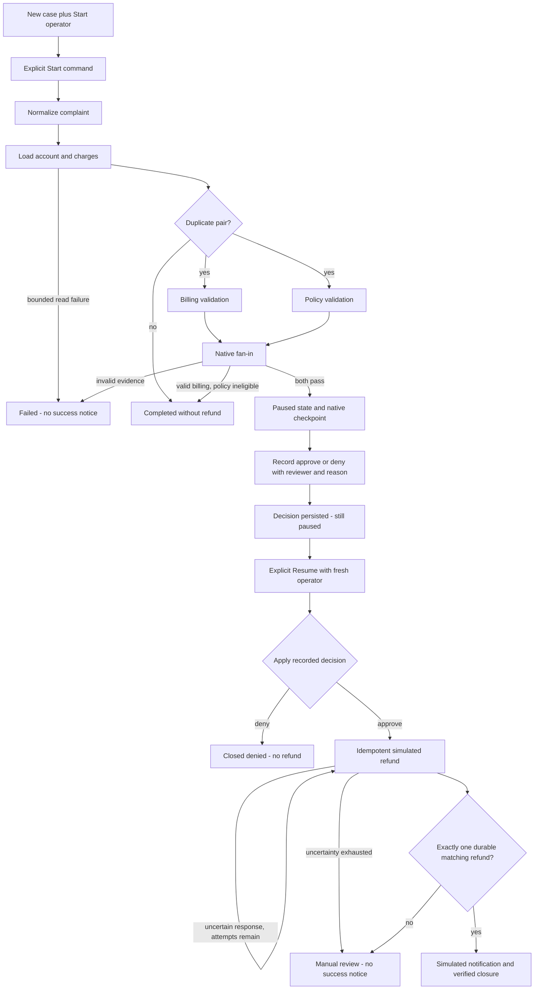

# MAF user flow

This journey describes the current MAF three-pane workspace, not the older
deployed UI. See [requirements](prd.md), [approval rules](business-rules.md#approval-and-resume-rules)
and [architecture](architecture.md).

## Open, select and observe

The left **History** pane loads persisted cases newest first, ten at a time.
**Load more** follows keyset cursors. Selecting a case restores saved context,
approval evidence, audit and outcome; the URL preserves that selection on reload.
Deep links resolve a case directly even when it is not on the first history page.
Head refresh bridges to loaded history and retains newer live statuses rather
than allowing a delayed history response to overwrite them.

**New case** opens a separate editable draft. Supply complaint, fixture/customer
context and Start operator. The browser allocates a fresh case ID and case-bound
idempotency key and sends one explicit Start. It discovers the persisted run and
subscribes while that synchronous request is still pending; there is no worker
queue or automatic command retry.

Before sending, the browser saves the original command and its separate UUID
`request_id` in tab session storage. After an ambiguous error or reload, **Retry
same Start request** resends those exact identities, not a replacement case.
PostgreSQL returns the original completed receipt or an explicit in-progress
response with the original run IDs; changed intent is rejected. Storage errors
block submission visibly. A failed process can leave a pending claim that requires
inspection rather than automatic workflow replay. GET state and native evidence,
not the old Start receipt, determine whether approval/resume is currently valid.

The middle **Execution** pane shows case context and command controls, live
technical timeline, state/memory/outcome inspectors, and collapsible workflow
graph and read-only assistant. The right **Audit trail** shows deterministic
business milestones with recorded times, actors, decisions/reasons and safe
evidence. Technical node/checkpoint identifiers belong to the timeline, not the
business narrative. The status header is explicitly a current snapshot.

## Business path

This folds the earlier root workflow diagram into the actual MAF routes: denial
closes **after Resume**, policy rejection is no-refund, and invalid evidence is
failure rather than an invented generic manual-review branch.

## Paused and reopened cases

Wait for the persisted current checkpoint and decision eligibility. Enter reviewer
and reason and record approve or deny. No refund happens at this step. Reloading
restores the decision. Enter a separate Resume operator and explicitly continue.
Resume requested and processing continued are distinct audit milestones.

A refund record/recovered receipt is also distinct from verification. Manual review
means unresolved work, not a successful refund. The UI must not derive a historical
resolution from a later snapshot or invent a delivery receipt for simulated notice.

## Live updates and failure states

Native SSE at `/api/runs/{run_id}/events/stream?after=<sequence>` replays committed
events and follows new ones. It also sends independently changed safe snapshots
when state/approval/outcome changes without a new event. Reconnection resumes by
sequence cursor; bounded batches and idle connection release avoid retaining a
database connection while waiting.

The stream can show live application audit events during Start/Resume. Framework
events collected after native invocation completes are persisted later and are
not mislabeled as live observations of their original execution time. The stream
is not Application Insights telemetry and does not need it to render progress.

Read/disconnect/malformed-stream errors are surfaced without claiming success or
automatically repeating business commands. A lost HTTP response requires reading
the case's durable state before deciding what explicit action remains valid.
`failed` and `manual_review` are visible end states with no success notification;
paused state is waiting for human action, not a failure.

## Optional selected-run explanation

The CopilotKit/AG-UI assistant explains allowlisted selected-run facts only. It
cannot mutate the workflow. Switching cases detaches and settles an old stream
before the shared client is cleared/reused, so an explanation for case A cannot
appear under case B. Reviewer reasons and actor metadata are not model facts.

See [the lane README](../../README.md#api-flow) for curl commands and
[the ledger](issues-changes-fixes.md) for dated browser and proxy evidence.
Current source capabilities do not imply that historical hosted/API revisions
have this workspace.
