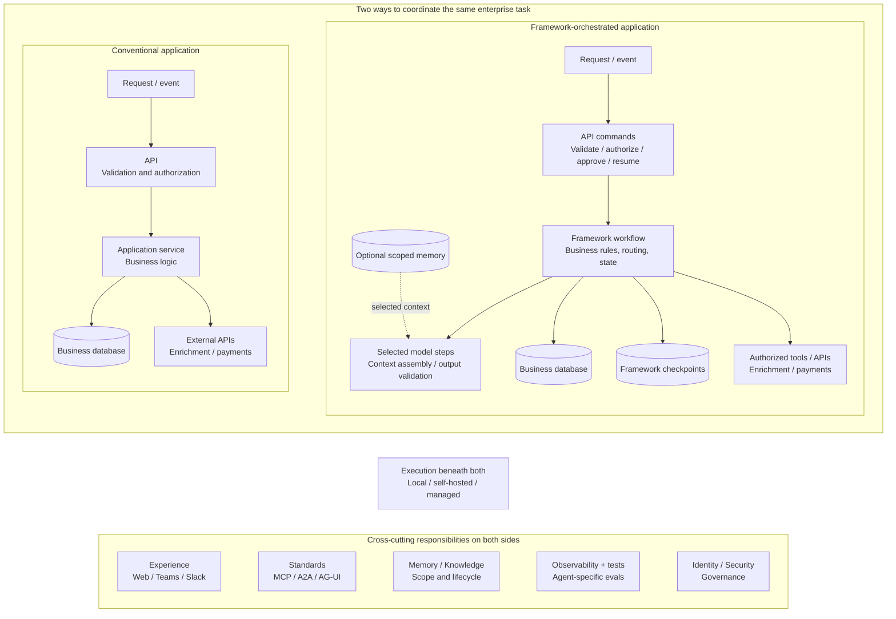
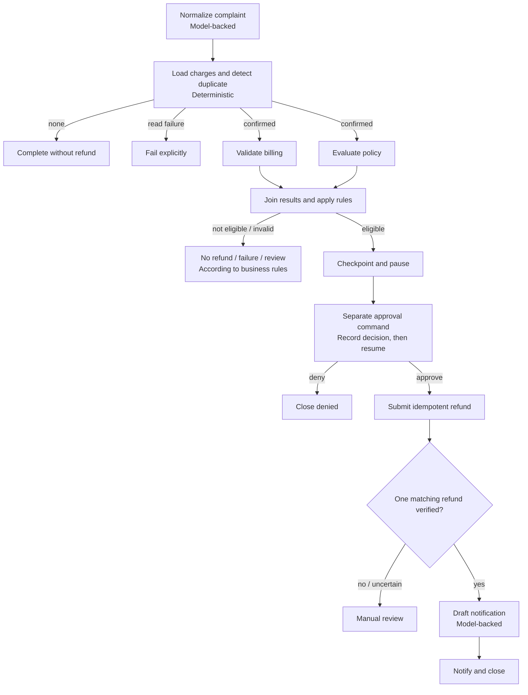
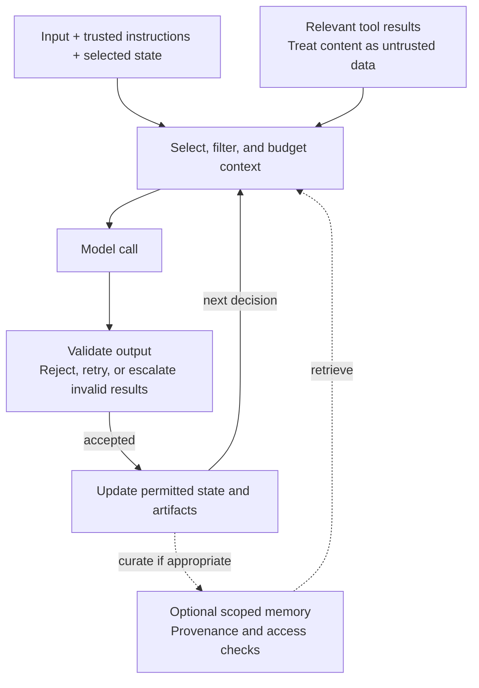

# Agent Frameworks: Predictable Workflows Around Model Judgment

## 1. Enterprise automation needs more than a clever next step

A customer says they were charged twice. A useful system must investigate, apply policy, obtain approval, issue one refund, and verify the result. A convincing explanation is not enough.

In [Part 1](model-to-harness.md), we separated three responsibilities:

> **Framework = how work is coordinated. Harness = what surrounds the agent so it can finish and verify the work. Runtime = where that work executes and survives.**

This article explores the first responsibility through two independent implementations: [Microsoft Agent Framework (MAF)](../../agent-framework/double-charge/maf/README.md) and [LangGraph](../../agent-framework/double-charge/langgraph/README.md). Both implement the same double-charge business contract. Their orchestration, APIs, storage adapters, interfaces, telemetry, and deployment code remain separate.

**Predictable orchestration does not make a model deterministic.** It makes the permitted steps, state changes, approval boundaries, and failure routes explicit. Models can interpret language inside those boundaries; deterministic code decides whether a payment is eligible and whether the required evidence exists.

In this case, models normalize the complaint and draft the final notification. Code handles duplicate detection, billing validation, policy, approval, refund submission, and verification. The payment systems are deterministic simulators, not real processors.

Not every automation needs an agent framework. A conventional service or workflow engine may already solve the problem. Frameworks become useful when model calls, tool execution, stateful coordination, and human intervention otherwise require substantial custom plumbing.

## 2. What changes from an application flow to an agentic flow?

A conventional application validates a request, applies business logic, reads or writes a database, and calls external APIs. An agentic application still needs those responsibilities. It adds a coordination layer that can combine predetermined steps with model-directed decisions.

The runtime does not replace the API, and memory does not replace the business database.



Solid arrows show requests and dependencies; results return upstream. The dotted memory input is optional. The bottom bands describe common responsibilities, not shared code or infrastructure between the two implementations.

| Responsibility | Conventional application | Framework-orchestrated application |
|---|---|---|
| Entry and validation | API schemas, authorization, business checks | Same controls, plus explicit start, approve, and resume commands |
| Coordination | Service code, queues, or workflow engine | Graph/workflow mixing code, tools, model calls, and human boundaries |
| Business authority | Database and authoritative external systems | Still the database and external systems, not model output |
| Continuing work | Application-managed state and recovery | Application state plus framework-owned checkpoints |
| Information for decisions | Request data and retrieved records | Selected context assembled from those sources and optional memory |

These are illustrative architectures, not exclusive feature lists: ordinary applications can also use durable workflows, memory, and AI. Separate storage boxes distinguish ownership; they need not be separate database products.

Also distinguish **read-only enrichment** from **consequential action**. Looking up a charge and issuing a refund may both be API calls, but only one changes financial state.

## 3. Framework primitives through one durable case

The [business rules](../design/business-rules.md) come before framework syntax. A duplicate requires two distinct captured charges with matching account, purchase reference, amount, and currency. Eligible refunds require approval. Completion requires independent verification.



This is a business-level map, not a rendering of either framework's internal graph. Operational failures also need explicit routes rather than a success-shaped default.

### Common capabilities, not universal guarantees

| Primitive | What it means | What to design deliberately |
|---|---|---|
| Graph/workflow | The permitted execution structure | Entry, branches, loops, terminal outcomes, and sub-workflows |
| Node/executor | A unit of code, model work, tool use, or human interaction | Input/output contract and side effects |
| Edge/route | A permitted move between steps | Conditions, failure routes, and stopping rules |
| State transition | An update to execution truth | Authoritative fields, validation, and ownership |
| Parallel branch and join | Independent work followed by reconciliation | Merge rules, conflicting updates, and readiness |
| Checkpoint | Framework execution state saved for recovery | Backend durability, identity, serialization, and compatibility |
| Interrupt/pause/resume | Stop execution and continue with external input | Approval validity and what may execute again |
| Event/stream | An observable execution record or projection | Ordering, retention, and safe payloads |
| Failure controls | Retries, timeouts, cancellation, and escalation | Bounded attempts and business-specific recovery |

Availability and APIs vary. A checkpointer stored only in process memory does not survive a process restart. A cancellation signal does not undo an already-issued refund.

### Same validation work, different graph expression

The implementations fan out to deterministic billing and policy checks. They are not two autonomous agents.

In the [MAF workflow](../../agent-framework/double-charge/maf/backend/src/maf_double_charge/maf/workflows/double_charge.py), this is a fragment of the fluent `WorkflowBuilder` chain:

```python
.add_fan_out_edges(prepare_validation, [billing_validation, policy_validation])
.add_fan_in_edges([billing_validation, policy_validation], join_validations)
```

The enclosing builder, executor definitions, conditions, and terminal routes are omitted. MAF routes values between executors; the join receives the validation results and applies the next business decision.

The [LangGraph workflow](../../agent-framework/double-charge/langgraph/backend/src/model_to_harness_langgraph/workflow.py) expresses the corresponding section with named nodes:

```python
builder.add_edge("dispatch_validations", "billing_validation")
builder.add_edge("dispatch_validations", "policy_validation")
builder.add_edge("billing_validation", "join_validations")
builder.add_edge("policy_validation", "join_validations")
builder.add_conditional_edges(
    "join_validations",
    self.route_validation,
    {"eligible": "request_approval", "failed": "fail_validation"},
)
```

Here `builder` is a `StateGraph(DoubleChargeState)` with nodes already registered. These same-step branches update `validation_results` through an application-defined reducer, and the join checks both results. Two incoming edges should not be mistaken for a general barrier across arbitrary unequal-length branches.

**State is more than a message history.** It includes evidence IDs, approval status, retry counts, verification results, and the next permitted transition. Parallel updates need deliberate merge rules, not an assumption that whichever write finishes last is correct.

### Checkpointing, approval, and resumption

Both applications keep business state and audit records in PostgreSQL. Framework checkpoints describe how execution resumes; they do not replace the approval record or refund ledger.

MAF uses an application-owned PostgreSQL adapter for its checkpoint interface. LangGraph uses its PostgreSQL checkpointer, separately namespaced from application audit data.

The [MAF approval executor](../../agent-framework/double-charge/maf/backend/src/maf_double_charge/maf/executors/approval.py) requests typed external input:

```python
await ctx.request_info(
    ApprovalRequest(
        case_id=paused.case_id,
        run_id=paused.run_id,
        evidence_summary=evidence.rationale,
        amount=str(evidence.amount) if evidence.amount is not None else None,
        currency=evidence.currency,
    ),
    ApprovalResponse,
    request_id=f"approval::{paused.run_id}",
)
```

This excerpt omits preceding validation and persistence. `ApprovalRequest` and `ApprovalResponse` are application-defined types; the executor's response handler processes the typed response. The [application service](../../agent-framework/double-charge/maf/backend/src/maf_double_charge/application/service.py) records approval separately. The [MAF runner](../../agent-framework/double-charge/maf/backend/src/maf_double_charge/maf/runner.py) supplies that persisted decision through `responses` when resuming the workflow from its checkpoint.

LangGraph's node instead calls `interrupt`:

```python
response = interrupt(
    {
        "kind": "refund_approval",
        "case_id": state["case_id"],
        "run_id": state["run_id"],
        "summary": "Duplicate charge and policy evidence passed; approve refund?",
    }
)
decision = str(response.get("decision", "deny"))
```

Its [service](../../agent-framework/double-charge/langgraph/backend/src/model_to_harness_langgraph/service.py) constructs the resume input from the recorded approval:

```python
command = Command(
    resume={
        "decision": approval["decision"],
        "reviewer_id": approval["reviewer_id"],
        "reason": approval.get("reason"),
    }
)
```

`interrupt` and `Command` come from `langgraph.types`. The service then invokes the compiled graph with this command and the original run-derived thread ID. These are excerpts, not standalone programs: checkpointer configuration, authorization, pending-approval checks, and invocation are essential omitted setup.

Neither mechanism makes chat text an approval. A reviewer submits a decision for the current checkpoint; the application validates and persists it; a separate resume command continues the run. No web request needs to remain blocked while the reviewer considers the case.

In LangGraph, the interrupted node starts again on resume. Code before `interrupt()` can run again; this implementation deduplicates its pre-interrupt audit writes. Placing a side effect after the interrupt avoids that particular repetition but does not guarantee exactly-once execution after every possible failure.

### Replay is not one operation

| Operation | Meaning | Can it repeat work? |
|---|---|---|
| Event replay | Read persisted history to reconstruct a UI or audit view | Not by itself; it reads records |
| Checkpoint resume | Continue a paused or interrupted execution | Depends on framework boundaries and surrounding code |
| Workflow replay/fork | Execute again from an earlier saved point | Yes: later model calls, tools, and interrupts may run again |

The repository demonstrates durable history and checkpoint-based recovery. It does not establish deterministic event-sourced re-execution. [LangGraph time travel](https://docs.langchain.com/oss/python/langgraph/use-time-travel) explicitly allows later steps to execute again and produce different results.

## 4. Reliability and middleware: boundaries still need business rules

Consider the uncertain-refund fixture: the provider stores the refund, but the caller loses the response. Retrying with a new key could issue another refund; treating the error as proof that nothing happened is equally unsafe.

The applications use a stable idempotency key, a request fingerprint, and a durable refund ledger. Equivalent retries recover the same business result; conflicting use of a key is rejected. Verification must observe one matching refund before notification can claim success. Ambiguous evidence routes to review.

This is **at-least-once execution protected by idempotency and verification**, not an exactly-once guarantee supplied by the framework. A real integration also needs the payment provider's contract, reconciliation, and recovery for gaps between remote writes and local records.

The [LangGraph reconstruction test](../../agent-framework/double-charge/langgraph/backend/tests/test_idempotency.py) ends with:

```python
completed = await service3.continue_run(started.case_id)

assert completed.status == "completed"
assert len(audit.refunds) == 1
outcome = (await service3.get_case(started.case_id)).outcome
assert outcome and outcome.refund_status == "verified"
```

Its setup reconstructs services around a refund breakpoint while retaining in-memory stores. That is useful recovery evidence, but not itself proof of database durability. Separate [MAF](../../agent-framework/double-charge/maf/backend/tests/integration/test_postgres.py) and [LangGraph](../../agent-framework/double-charge/langgraph/backend/tests/test_postgres_integration.py) PostgreSQL integration tests cover persistent reconstruction.

Retries also need classification. A temporary billing-read failure can receive bounded retries. Policy rejection, invalid input, and a conflicting approval require different routes; they are not transient transport errors.

### Middleware is a place to enforce policy, not the policy itself

| Boundary or hook | Useful behavior | Limit |
|---|---|---|
| API ingress | Validate schema, identity, and command authority | A valid request can still propose a prohibited business action |
| Model/agent call | Select context, validate output, enforce budgets, redact sensitive data | Valid structured output is not proof of truth |
| Tool invocation | Check permission, arguments, approval, timeout, and retry policy | Middleware cannot invent a provider's idempotency guarantee |
| Workflow node/transition | Record events, classify failure, route or cancel | Recovery must respect persisted business state |
| UI/telemetry projection | Allowlist safe summaries and correlation IDs | Hiding fields is not a comprehensive PII detection system |

[MAF agent middleware](https://learn.microsoft.com/en-us/agent-framework/concepts/agents/middleware/) intercepts agent/model/function interactions. [LangChain middleware](https://docs.langchain.com/oss/python/langchain/middleware/overview) can wrap higher-level agents built on LangGraph. A raw `StateGraph` node is not automatically surrounded by those agent middleware hooks.

The repository demonstrates explicit retries, failure routes, and safe event projections. General PII detection, automatic compaction, and universal rate-limit middleware are extension ideas here, not implemented guarantees. Sensitive-input processing belongs before data reaches a model or tool, not merely before displaying the answer.

## 5. State, memory, and the context a model actually receives

**Application state** answers what is true about the case. **Checkpoint state** records framework execution progress. **Memory** retains selected knowledge for later use. **Context** is the temporary input assembled for one model decision.

Two different classifications help:

| Dimension | Categories | Example |
|---|---|---|
| Recall scope | Short-term/thread-scoped; long-term/cross-session | Current case history versus a retained customer preference |
| Retained content | Semantic facts; episodic experiences; procedural instructions | Customer facts; a prior resolution summary; an approved procedure |

**Working memory** is the active information used for the current task or decision, not a fourth long-term storage category. Short-term state may be persisted durably. Semantic memory means facts and knowledge, not necessarily embeddings or semantic search.

[LangGraph distinguishes checkpointers from stores](https://docs.langchain.com/oss/python/langgraph/persistence): the first persist thread state, while the second retain cross-thread application data. Neither replaces the authoritative payment record.

### Context is assembled, not automatically inherited



This is a configurable design pattern, not a claim that the example implements every box. Framework state can carry data between steps; application code or a configured context provider decides what enters the model input. Retrieval, summarization, filtering, and token budgets require deliberate choices.

The actual [MAF model boundary](../../agent-framework/double-charge/maf/backend/src/maf_double_charge/maf/clients.py) and [LangGraph adapter](../../agent-framework/double-charge/langgraph/backend/src/model_to_harness_langgraph/model_adapter.py) are intentionally narrow:

| Model operation | MAF input data | LangGraph input data |
|---|---|---|
| Normalize complaint | Complaint text | Complaint text |
| Draft notification | Refund status, refund ID, duplicate summary | Case ID, refund status, refund ID |

Both workflows retain selected case facts, but neither injects those stored facts into these two model calls. A table named “memory” does not mean the model used it. The implementations also do not provide a general semantic/episodic/procedural memory system.

A future context provider could retrieve a scoped preference or earlier resolution. It should preserve provenance, enforce access controls, and avoid promoting retrieved instructions or tool text into trusted authority. Retention, correction, deletion, and procedural updates belong to explicit policies—not an agent freely rewriting its own rules.

## 6. Workflow and multi-agent orchestration patterns

Patterns organize work; they do not all require a team of agents.

| Pattern | Shape | Useful when | Main caution |
|---|---|---|---|
| Sequential | A -> B -> C | Each stage depends on the previous result | Errors propagate unless intermediate results are checked |
| Parallel | A and B independently | Checks do not depend on each other | Concurrent state writes need rules |
| Fan-out/fan-in | Distribute -> collect -> reconcile | Several independent results feed one decision | Define completeness, merge policy, and partial failure |
| Conditional routing | Choose one next step | Evidence or validated classification selects a path | Model-suggested routes must remain permitted routes |
| Handoff | Transfer responsibility/context | Another specialist should own the next interaction | State and authority do not transfer implicitly |
| Supervisor/subagents | Coordinator delegates bounded work | Specialized context or independent subtasks justify it | Budget, permissions, and result verification remain necessary |
| Group chat | Moderated contributions | Several perspectives are genuinely useful | Discussion needs termination and a decision owner |
| Evaluator/revision loop | Produce -> check -> revise | An artifact can improve against a defined rubric | Bound iterations; a model judging another model is not business proof |

The double-charge workflow uses sequential steps, parallel validation, a join, and conditional routes. Its billing and policy nodes are deterministic functions. Procurement or incident handling might benefit from specialist agents, but adding agents where ordinary code suffices increases latency, cost, and coordination risk.

## 7. Choosing a framework: a landscape, then a concrete comparison

The following is a curated landscape, not an adoption ranking. SDKs, workflow engines, and higher-level agent packages overlap; product labels alone do not establish durability or operational guarantees.

| Framework or SDK | Primary emphasis | Selection question |
|---|---|---|
| [Microsoft Agent Framework](https://learn.microsoft.com/en-us/agent-framework/overview/) | Agents, typed workflow executors, integrations | Does its workflow and integration model fit the application? |
| [LangGraph](https://docs.langchain.com/oss/python/langgraph/overview) | Explicit stateful graph orchestration | Do you want direct control over graph state and execution? |
| [LangChain](https://docs.langchain.com/oss/python/langchain/overview) | Higher-level agent and integration abstractions | Would a packaged agent loop reduce custom graph work? |
| [CrewAI](https://docs.crewai.com/) | Collaborative crews and flows | Does a role/task-oriented design suit the workload? |
| [Google ADK](https://adk.dev/) | Agent composition and development tooling | Do its context, workflow, and deployment integrations fit? |
| [OpenAI Agents SDK](https://openai.github.io/openai-agents-python/) | Agent loops, tools, handoffs, guardrails, tracing | Is a lightweight Python-first coordination model sufficient? |
| [Pydantic AI](https://pydantic.dev/docs/ai/overview/) | Typed agent inputs/outputs and dependencies | How important are typed contracts and provider flexibility? |
| [LlamaIndex Workflows](https://developers.llamaindex.ai/python/llamaagents/workflows/) | Event-driven, typed workflow steps | Does event-based coordination fit the data flow? |
| [Strands Agents](https://strandsagents.com/) | Model-driven agent SDK | Does its tool and model-provider ecosystem fit? |
| [smolagents](https://huggingface.co/docs/smolagents/index) | Lightweight code and tool-calling agents | Is minimal orchestration sufficient, with suitable execution isolation? |

Verify the chosen version's persistence, human-input, middleware, and hosting contracts. Tool calling alone does not imply durable workflows, and a framework's development server is not automatically a production operating environment.

### MAF versus LangGraph in this repository

| Concern | MAF implementation | LangGraph implementation |
|---|---|---|
| Core abstraction | `WorkflowBuilder`, executors, typed messages | `StateGraph`, typed state, named nodes |
| Parallel validation | Explicit fan-out/fan-in builder edges | Same-step branches, state reducer, join checks |
| Approval | Typed `request_info`, response handler, checkpoint-based workflow resume | `interrupt`, recorded approval, `Command(resume=...)`, stable thread |
| Checkpoint persistence | Application PostgreSQL adapter implementing MAF storage | LangGraph PostgreSQL checkpointer |
| Failure handling | Explicit bounded loops and business routes | Selected `RetryPolicy` use plus explicit graph retry/failure routes |
| Model context | Application-owned MAF agents/model client | Application-owned model adapter inside nodes |
| Audit and UI | Captured framework events plus application audit and own projection | Application audit events plus own projection |
| Business authority | Application records and refund ledger | Application records and refund ledger |

The [MAF lockfile](../../agent-framework/double-charge/maf/uv.lock) resolves core `1.16.0` and Foundry integration `1.11.0`; the [LangGraph lockfile](../../agent-framework/double-charge/langgraph/uv.lock) resolves LangGraph `1.2.11` and PostgreSQL checkpointer `3.1.2`. These identify the repository snapshot, not whatever version a reader has installed.

MAF makes typed executor/message boundaries prominent. LangGraph makes state updates and routing prominent. In these implementations, MAF's custom checkpoint adapter is an additional maintenance seam; LangGraph's state merges and interrupt re-entry need explicit care. These are concrete trade-offs, not proof that one framework is universally safer.

Both applications need their own authorization, approval service, persistence, idempotency, and verification. Shared fixtures and [normalized evaluation contracts](../../shared/README.md) allow comparison by business behavior rather than framework-local IDs or identical event payloads.

The fixture set covers a confirmed duplicate, no duplicate, denial, exhausted billing-read retries, an uncertain refund response, resumed approval, and a verification mismatch. Compare the resulting business route and refund evidence, not whether both frameworks produce the same wording or checkpoint representation.

## 8. Applying the pattern beyond refunds

**Procurement approval.** A model extracts an informal purchase request. Deterministic checks validate vendor, budget, and spending policy; approval is persisted before creating a purchase order. An idempotent submission and record lookup verify the outcome. Episodic examples may help interpret requests, but cannot override spending authority.

**IT incident response.** A model summarizes alerts and proposes diagnostic hypotheses. Independent read-only checks gather evidence; policy determines whether remediation needs approval. After an authorized change, health checks establish recovery or route to escalation. A failed response from a remediation API is not proof that the change never happened.

These are illustrative designs, not additional implemented workflows or measured customer success stories. The reusable idea is the boundary between interpretation, deterministic control, consequential action, and evidence.

## 9. The concerns around the framework—and the runtime underneath

Much of enterprise architecture stays familiar. What changes is the set of decisions, artifacts, and permissions that must remain inspectable.

| Concern | Shared foundation | Additional agentic responsibility |
|---|---|---|
| Experience | Web, Teams, Slack, APIs, review screens | Show progress and safe decision summaries; use explicit start/approve/resume commands |
| Interoperability | Contracts between services and interfaces | [MCP](https://modelcontextprotocol.io/specification/latest) for tools/context, [A2A](https://a2a-protocol.org/latest/) for agents, [AG-UI](https://docs.ag-ui.com/) for UI projections |
| Memory/knowledge | Data ownership, access, retention | Trace which selected facts influenced a decision and why they were retained |
| Observability/evaluations | Logs, traces, metrics, tests | Model/tool trajectories, source use, approval compliance, token cost, latency, and outcome evaluation |
| Identity/security/governance | Authentication, authorization, audit, policy | Delegated authority, per-tool scopes, human approval, and controls on generated actions |

Observability is not agent-only. Neither is evaluation: applications with probabilistic components also need it. Agent systems add questions beyond whether the endpoint returned success: did they use the right evidence, obey approvals, avoid duplicate side effects, and reach a verified outcome?

An API gateway can enforce access, quotas, and traffic policy. It cannot replace authorization in downstream systems, approval state, memory scope, or the refund verification boundary.

In this repository, durable events are the source for UI projections. AG-UI does not become the command bus; prompts, credentials, raw checkpoints, and unrestricted tool payloads do not belong in the browser.

### Local, self-hosted, or managed

The runtime executes the framework. Depending on its implementation, it provides persistence, workers, queues, isolation, scheduling, recovery, and scaling.

| Choice | What you still need to decide |
|---|---|
| Local | Which state survives a restart, how tools are restricted, and how failures are reproduced |
| Self-hosted | Who operates databases, workers, isolation, upgrades, observability, and recovery |
| Managed hosted agents | Which guarantees the service actually provides and which application responsibilities remain |

[Microsoft Foundry Hosted Agents](https://learn.microsoft.com/en-us/azure/foundry/agents/concepts/hosted-agents), [Claude Managed Agents](https://platform.claude.com/docs/en/managed-agents/overview), and [Managed Deep Agents](https://docs.langchain.com/langsmith/python/managed-deep-agents-overview) offer different combinations of hosting and agent/harness capabilities. They are not interchangeable checkpoint contracts.

The [repository architecture](../design/architecture.md) documents separate hosted lanes as well as local execution. That is an implementation reference, not a claim of current live health, real payment processing, or production readiness. Hosting the code does not transfer responsibility for the business outcome.

## 10. Finish with evidence, not framework syntax

A framework is valuable when it makes the next permitted action, current state, recovery boundary, and result easier to understand and operate.

For the double-charge case, the important evidence is not that a graph finished. It is that approval was recorded, exactly one matching refund was verified, failures followed explicit routes, and durable history explains the outcome.

The implementation companions—[requirements](../design/prd.md), [business rules](../design/business-rules.md), [approval conditions](../design/hitl-approval-conditions.md), and [architecture](../design/architecture.md)—define that contract before either framework expresses it.

This is Part 2 of seven. Next comes **the harness**: the richer environment around coordinated work. Later articles cover **runtimes**, **memory and knowledge**, **observability and evaluations**, and **identity, security, and governance**.

> **The model can propose what to do. The workflow must establish what may happen, preserve what did happen, and verify whether the task actually succeeded.**

## Further references

Code links above point to implementation excerpts; omitted setup is required to run them. Framework capabilities and APIs vary by version, so consult the repository lockfiles and the current official guides together.

- [MAF workflow concepts](https://learn.microsoft.com/en-us/agent-framework/concepts/workflows/)
- [MAF middleware](https://learn.microsoft.com/en-us/agent-framework/concepts/agents/middleware/)
- [LangGraph workflows and agents](https://docs.langchain.com/oss/python/langgraph/workflows-agents)
- [LangGraph interrupts](https://docs.langchain.com/oss/python/langgraph/interrupts)
- [LangGraph persistence](https://docs.langchain.com/oss/python/langgraph/persistence)
- [LangGraph time travel](https://docs.langchain.com/oss/python/langgraph/use-time-travel)
- [Memory scope and content types](https://docs.langchain.com/oss/python/concepts/memory)
- [LangChain agent middleware](https://docs.langchain.com/oss/python/langchain/middleware/overview)
