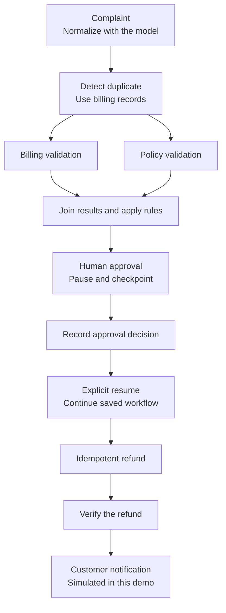
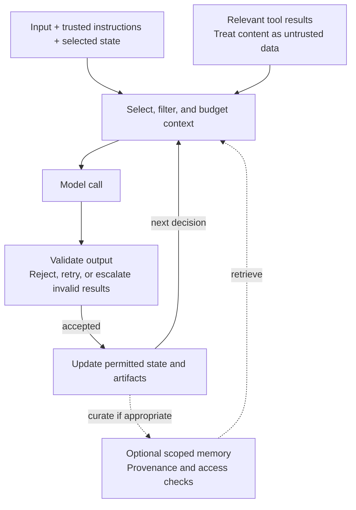
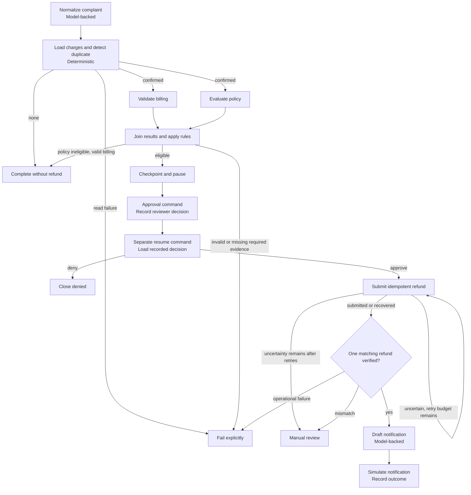

# Agent Frameworks: Predictable Workflows Around Model Judgment

## 1. Why: from model calls to coordinated work

A customer says they were charged twice. A useful system must investigate, apply policy, obtain approval, issue one refund, and verify the result. A convincing explanation is not enough.

In [Part 1](model-to-harness.md), we separated three responsibilities:

> **Framework = how work is coordinated. Harness = what surrounds the agent so it can finish and verify the work. Runtime = where that work executes and survives.**

This article explores the first responsibility through two independent implementations: [Microsoft Agent Framework (MAF)](../../agent-framework/double-charge/maf/README.md) and [LangGraph](../../agent-framework/double-charge/langgraph/README.md). Both implement the same double-charge business contract. Their orchestration, APIs, storage adapters, interfaces, telemetry, and deployment code remain separate.

**Predictable orchestration does not make a model deterministic.** It makes the permitted steps, state changes, approval boundaries, and failure routes explicit. Models can interpret language inside those boundaries; deterministic code decides whether a payment is eligible and whether the required evidence exists.

In this case, models normalize the complaint and draft the final notification. Code handles duplicate detection, billing validation, policy, approval, refund submission, and verification. The payment systems are deterministic simulators, not real processors.

Not every automation needs an agent framework. A conventional service or workflow engine may already solve the problem. Frameworks become useful when model calls, tool execution, stateful coordination, and human intervention otherwise require substantial custom plumbing.

## 2. What: the coordination a framework adds

> **Framework = structures how work progresses across steps, agents, tools, state, and human boundaries.**

A model call produces an answer or a proposed action. A framework lets the application express what can happen next, what data each step needs, how branches join, and where execution must stop for external input. It provides coordination mechanisms; the developer still implements the business rules.

The double-charge workflow is pre-structured: investigate, validate, obtain approval, submit, verify, and notify. Individual steps can still contain model judgment. The model can interpret the complaint, but it cannot turn a rejected approval into permission to refund.

Frameworks can also support model-directed routing, handoffs, and agent loops. [LangGraph distinguishes predefined workflows from dynamic agents](https://docs.langchain.com/oss/python/langgraph/workflows-agents) and supports both. Predictability here means explicit contracts and permitted transitions, not identical model outputs or a single fixed path for every case.

## 3. Anatomy: the building blocks our case needs

To resolve the double charge, we need a few simple coordination tools. Each becomes useful at a specific point in the case:

| Business need | Framework primitive | Meaning |
|---|---|---|
| Describe the whole investigation-to-refund process | Graph/workflow | The allowed steps and paths |
| Perform one piece of work, such as detecting a duplicate | Node/executor | A unit of code, model work, or tool use |
| Choose whether to close the case or investigate further | Edge/route | The next permitted step |
| Carry the evidence and approval decision forward | State | What the workflow currently knows |
| Check billing and policy at the same time, then combine results | Parallel branches / fan-out / fan-in | Split independent work and join it before continuing |
| Keep progress when the work must stop | Checkpoint | Saved execution progress |
| Wait for a reviewer, then continue | Pause/resume | A boundary for external input |
| Handle a temporary failure without looping forever | Failure handling/retries | Bounded attempts and explicit failure routes |

These mechanisms coordinate the work; application rules decide what is allowed. We will use them in order in the walkthrough. Advanced recovery and middleware details are retained in the [optional technical appendix](#technical-appendix-optional-deeper-reading).

## 4. State, checkpoints, context, and memory

| Concept | Meaning | Double-charge example |
|---|---|---|
| State | Current workflow truth | The duplicate evidence and recorded approval |
| Checkpoint | Saved workflow progress | Where and how execution can continue after a pause |
| Context | What the model sees for one call | Complaint text, or selected refund facts for a customer update |
| Memory | Retained knowledge | A customer preference or fact kept for later use |

In this repository, PostgreSQL application records hold the business state and audit, while framework-owned checkpoints support continuation. **Checkpoint state is not authoritative business state:** knowing where to resume does not prove a refund happened. Checkpoints need durable storage to survive process loss.

The model does not automatically see everything stored in state or memory. These workflows give it complaint text for normalization and selected refund facts for notification. Context assembly and memory mechanics are preserved in the appendix; their broader design belongs to the later memory chapter.

## 5. Orchestration patterns: not necessarily multiple agents

Patterns combine the primitives into useful shapes. Our case uses five:

| Pattern | In the double-charge workflow |
|---|---|
| Sequential | Submit the refund, verify it, then notify the customer |
| Parallel | Run billing and policy checks independently |
| Fan-out/fan-in | Start both checks, then join their results into one decision |
| Conditional routing | Continue, deny, fail, or send for review based on evidence |
| Human-in-the-loop | Pause for a reviewer and resume using the recorded decision |

Billing and policy checks are deterministic functions, not autonomous agents. Parallel work does not require a team of agents.

Handoffs, supervisor/subagent delegation, and evaluator/revision loops are useful extensions for other workloads. They are not part of this demo; the appendix retains their trade-offs. Here, refund verification checks business evidence rather than asking another model to judge the answer.

## 6. Worked example: one double-charge case, two implementations

The [business rules](../design/business-rules.md) come before framework syntax. A duplicate requires two distinct captured charges with matching account, purchase reference, amount, and currency. Eligible refunds require approval. Successful refund completion requires a separate verification step.

The main path is the same in both implementations. Progress is checkpointed while waiting for approval; the reviewer decision is recorded before execution resumes.



This diagram shows the approved-refund path, not every branch. No duplicate or policy ineligibility closes without a refund; denial stops the refund path. Exhausted billing reads fail explicitly, while unresolved refund responses and verification mismatches require manual review.

### Step 1: turn the complaint into a case

The customer says, "I was charged twice." The application creates a case/run through an explicit start command. A model-backed **node/executor** normalizes the complaint so later steps can work with it.

The [MAF application service](../../agent-framework/double-charge/maf/backend/src/maf_double_charge/application/service.py) and [LangGraph application service](../../agent-framework/double-charge/langgraph/backend/src/model_to_harness_langgraph/application/service.py) own the start command and persisted business records. The model helps interpret the request; it does not authorize a refund.

### Step 2: check whether there really is a duplicate

Now the workflow needs evidence, not more confident wording. Deterministic code loads the charges and checks whether two captured charges match the business rules.

The [MAF investigation executors](../../agent-framework/double-charge/maf/backend/src/maf_double_charge/maf/executors/investigation.py) and [LangGraph investigation nodes](../../agent-framework/double-charge/langgraph/backend/src/model_to_harness_langgraph/graph/nodes/investigation.py) produce that evidence. A **conditional route** closes a no-duplicate case or continues to validation. Temporary read failures have bounded retries.

### Step 3: validate billing and policy in parallel

We need both billing evidence and policy eligibility, but neither check needs to wait for the other. This is where **parallel branches** become useful.

In the [MAF workflow](../../agent-framework/double-charge/maf/backend/src/maf_double_charge/maf/workflows/double_charge.py), this is a fragment of the fluent `WorkflowBuilder` chain:

```python
.add_fan_out_edges(prepare_validation, [billing_validation, policy_validation])
.add_fan_in_edges([billing_validation, policy_validation], join_validations)
```

The enclosing builder, executor definitions, conditions, and terminal routes are omitted. MAF routes values between executors; the join receives the validation results and applies the next business decision.

The [LangGraph workflow](../../agent-framework/double-charge/langgraph/backend/src/model_to_harness_langgraph/graph/workflows/double_charge.py) expresses the corresponding section with named nodes:

```python
builder.add_edge("dispatch_validations", "billing_validation")
builder.add_edge("dispatch_validations", "policy_validation")
builder.add_edge("billing_validation", "join_validations")
builder.add_edge("policy_validation", "join_validations")
```

Here `builder` is a `StateGraph(DoubleChargeState)` with nodes already registered. Both snippets express the same business intent: start the checks separately and bring their results to `join_validations`. The appendix explains the different join/state mechanics.

### Step 4: join the results before making a decision

The workflow must not request approval after seeing only one successful check. **Fan-in** brings the results together; application rules require both billing and policy to pass. With valid billing evidence, a known policy-ineligible decision closes as `completed_no_refund`; missing or invalid required evidence is not a policy rejection.

The [MAF validation executors](../../agent-framework/double-charge/maf/backend/src/maf_double_charge/maf/executors/validation.py) pass typed branch results to the join. The [LangGraph validation nodes](../../agent-framework/double-charge/langgraph/backend/src/model_to_harness_langgraph/graph/nodes/validation.py) store the results in workflow state and check them at the join. Missing or failed required evidence does not lead to a refund.

### Step 5: pause for human approval

Eligibility is not permission to move money. We need a reviewer, so the workflow reaches a **human-in-the-loop pause**.

This implementation's [MAF approval executor](../../agent-framework/double-charge/maf/backend/src/maf_double_charge/maf/executors/approval.py) uses `ctx.request_info(...)` to request a typed response. The [LangGraph approval node](../../agent-framework/double-charge/langgraph/backend/src/model_to_harness_langgraph/graph/nodes/approval.py) uses `interrupt(...)`. Typed input does not itself authenticate or authorize the reviewer.

In both cases, our application design uses an explicit command to record the reviewer's decision. Chat text is not approval, and recording approval does not itself resume execution. Separate commands are not a universal framework requirement.

### Step 6: resume from saved progress

The reviewer may return later. A **checkpoint** saves resumable execution state; the application and hosting model allow the request to end and later execution to resume. LangGraph restarts the interrupted node, so code before `interrupt()` runs again.

A separate resume command loads the recorded decision. The [MAF runner](../../agent-framework/double-charge/maf/backend/src/maf_double_charge/maf/runner.py) supplies it through `responses` while resuming the checkpoint. The [LangGraph runner](../../agent-framework/double-charge/langgraph/backend/src/model_to_harness_langgraph/graph/runner.py) uses `Command(resume=decision)` on the original workflow thread.

The approval record determines whether to continue or close the case as denied. The checkpoint tells the framework how to continue; it does not supply business authority.

### Step 7: refund with a stable identity and bounded retries

The approved case can now request a refund. But what if the refund is stored and its response is uncertain? The application must not treat every attempt as a new refund.

Both lanes use a **stable idempotency identity** and a durable refund ledger to recover the same result. The [MAF refund executor](../../agent-framework/double-charge/maf/backend/src/maf_double_charge/maf/executors/refund.py) uses a bounded retry loop; the [LangGraph refund node](../../agent-framework/double-charge/langgraph/backend/src/model_to_harness_langgraph/graph/nodes/refund.py) uses an explicit retry route.

The framework coordinates attempts. The application defines when retrying is safe, and a real payment provider must enforce the idempotency contract. **Retries alone do not prevent duplicate refunds.**

MAF's refund limit bounds one executor invocation; LangGraph persists attempts in graph state. Neither is a blanket lifetime-attempt guarantee across arbitrary crashes. If uncertainty remains after the allowed attempts, both lanes route to `manual_review` with `refund_outcome_uncertain` rather than claiming payment failure. Live-provider reconciliation remains outside this simulator-backed demo.

### Step 8: verify before claiming success

Now we need proof. A separate deterministic step checks the refund evidence and either permits notification or routes away from success.

MAF checks the durable ledger through `DurableRefundService.verify`; LangGraph checks the gateway result against its durable refund record. Both use the teaching ledger/simulator contract, not a live payment-provider lookup. In a real integration, verification must use **authoritative business evidence**.

**Workflow completion is not proof of business success.** A run can end in denial, failure, or manual review. The developer defines the success conditions, and the application enforces them; model confidence does not decide whether money moved.

### Step 9: notify the customer and record the result

Once the refund is verified, the model drafts the customer update. The [MAF notification executor](../../agent-framework/double-charge/maf/backend/src/maf_double_charge/maf/executors/completion.py) and [LangGraph completion nodes](../../agent-framework/double-charge/langgraph/backend/src/model_to_harness_langgraph/graph/nodes/completion.py) then record the notification and terminal outcome.

Notification is simulated in this repository; neither lane sends real email or SMS. The important ordering remains: **verify first, then tell the customer what happened**.

The case has now taught the core framework story: steps, routes, parallel checks, shared progress, a human boundary, continuation, controlled retries, and an evidence-based outcome. The appendix retains the seven-scenario matrix and detailed recovery tests for readers ready to inspect those guarantees.

## 7. Framework ecosystem and production boundaries

The following is a curated landscape, not an adoption ranking. SDKs, workflow engines, and higher-level agent packages overlap; product labels alone do not establish durability or operational guarantees.

| Framework or SDK | Primary emphasis | Selection question |
|---|---|---|
| [Microsoft Agent Framework](https://learn.microsoft.com/en-us/agent-framework/overview/) | Agents, typed workflow executors, integrations | Does its workflow and integration model fit the application? |
| [LangGraph](https://docs.langchain.com/oss/python/langgraph/overview) | Explicit stateful graph orchestration | Do you want direct control over graph state and execution? |
| [LangChain](https://docs.langchain.com/oss/python/langchain/overview) | Higher-level agent and integration abstractions | Would a packaged agent loop reduce custom graph work? |
| [CrewAI](https://docs.crewai.com/) | Collaborative crews and flows | Does a role/task-oriented design suit the workload? |
| [Google ADK](https://adk.dev/) | Agent composition and development tooling | Do its context, workflow, and deployment integrations fit? |
| [OpenAI Agents SDK](https://openai.github.io/openai-agents-python/) | Agent loops, tools, handoffs, guardrails, tracing | Does its coordination model fit the application's language and integration needs? |
| [Pydantic AI](https://pydantic.dev/docs/ai/overview/) | Typed agent inputs/outputs and dependencies | How important are typed contracts and provider flexibility? |
| [LlamaIndex Workflows](https://developers.llamaindex.ai/python/llamaagents/workflows/) | Event-driven, typed workflow steps | Does event-based coordination fit the data flow? |
| [Strands Agents](https://strandsagents.com/) | Model-driven agent SDK | Does its tool and model-provider ecosystem fit? |
| [smolagents](https://huggingface.co/docs/smolagents/index) | Lightweight code and tool-calling agents | Is minimal orchestration sufficient, with suitable execution isolation? |

Verify the chosen version's persistence, human-input, middleware, and hosting contracts. Tool calling alone does not imply durable workflows, and a framework's development server is not automatically a production operating environment.

### MAF versus LangGraph in this repository

| Concern | MAF implementation | LangGraph implementation |
|---|---|---|
| Core abstraction | `WorkflowBuilder`, executors, typed messages | `StateGraph`, typed state, named nodes |
| Parallel validation | Explicit fan-out/fan-in builder edges | Parallel nodes update state; a join checks both results |
| Approval | Typed `request_info`, response handler, checkpoint-based workflow resume | `interrupt`, recorded approval, `Command(resume=...)`, stable thread |
| Checkpoint persistence | Application PostgreSQL adapter implementing MAF storage | LangGraph PostgreSQL checkpointer |
| Failure handling | Explicit bounded loops and business routes | Selected `RetryPolicy` use plus explicit graph retry/failure routes |
| Model context | Application-owned MAF agents/model client | Application-owned model adapter inside nodes |
| Audit and UI | Captured framework events plus application audit and own projection | Application audit events plus own projection |
| Business authority | Application records and refund ledger | Application records and refund ledger |

MAF makes typed executor/message boundaries prominent. LangGraph makes state updates and routing prominent. Neither removes the need for application-owned business rules. Version pins and implementation-specific cautions are retained in the appendix.

Both applications need their own authorization, approval service, persistence, idempotency, and verification. Shared fixtures and [normalized evaluation contracts](../../shared/README.md) allow comparison by business behavior rather than framework-local IDs or identical event payloads.

### Surrounding concerns are not automatic framework features

| Concern | Responsibility around the workflow |
|---|---|
| Experience | Web, Teams, Slack, APIs, and review screens expose progress and safe summaries through explicit commands |
| Interoperability | [MCP](https://modelcontextprotocol.io/specification/latest) supports tools/context, [A2A](https://a2a-protocol.org/latest/) agent interoperability, and [AG-UI](https://docs.ag-ui.com/) UI projections; none establishes refund authority |
| Memory/knowledge | Define access, provenance, retention, and which selected information enters a decision |
| Observability/evaluations | Inspect execution, model/tool calls, approval compliance, cost, latency, and business outcomes |
| Identity/security | Authenticate callers and constrain delegated identity, permissions, and tool access |
| Governance | Define policy ownership, approval requirements, auditability, and change controls |
| API gateway | Enforce ingress access, quotas, and traffic policy without replacing downstream authorization or verification |

Framework integrations may help implement these concerns, but do not automatically supply their policies or guarantees. Telemetry describes what was observed; it is not the business ledger. Evaluations must ask whether the workflow obeyed approvals and reached the correct outcome, not just whether an endpoint returned success.

In this repository, durable events are the source for UI projections. AG-UI does not become the command bus; prompts, credentials, raw checkpoints, and unrestricted tool payloads do not belong in the browser.

### The runtime underneath

The runtime is the execution substrate beneath the framework: local, self-hosted, or managed. Depending on its implementation and configuration, it supplies workers, persistence infrastructure, isolation, scheduling, recovery, and scaling. The framework still has its own execution/checkpoint semantics; the application still owns approval, retry policy, idempotency, and completion rules. Framework and runtime describe responsibilities that may be supplied by the same product.

The [repository architecture](../design/architecture.md) documents the independent lanes and operating choices. Those details are implementation references, not a claim of current live health, real payment processing, or production readiness. **Runtime recovery does not imply business correctness.** The runtime chapter explores these operating responsibilities in depth.

## 8. From coordination to the harness

A framework is valuable when it makes the next permitted action, current state, recovery boundary, and result easier to understand and operate.

For the double-charge case, the important evidence is not that a graph finished. It is that approval was recorded, exactly one matching refund was verified, failures followed explicit routes, and durable history explains the outcome.

The implementation companions—[requirements](../design/prd.md), [business rules](../design/business-rules.md), [approval conditions](../design/hitl-approval-conditions.md), and [architecture](../design/architecture.md)—define that contract before either framework expresses it.

The next question is what surrounds that coordination: how the agent receives relevant context, accesses tools, works with artifacts, stays within permissions, and checks its result.

For this learning journey, the shift in emphasis is:

> **Framework:** "We know the allowed workflow; coordinate it reliably."
>
> **Harness:** "We know the goal; give the agent the environment to discover the path."

This is a teaching contrast, not a strict product boundary. Frameworks also support dynamic agents, and harnesses can contain pre-structured workflows. The harness adds the context, tools, permissions, workspace, and verification needed to pursue the goal.

This is the technical/repository version of Part 2 of seven. Article 3 explores **the harness** without replacing the business controls established here. Later articles cover **runtimes**, **memory and knowledge**, **observability and evaluations**, and **identity, security, and governance**.

> **The model can propose what to do. The workflow must establish what may happen, preserve what did happen, and verify whether the task actually succeeded.**

## Technical appendix: optional deeper reading

The main chapter ends above. The following material is retained for the technical/e-book edition and later deep dives; it is not a prerequisite for following the double-charge story.

### A. Replay, resume, events, and middleware

| Operation | Meaning | Can it repeat work? |
|---|---|---|
| Event replay | Read persisted history to reconstruct a UI or audit view | Not by itself; it reads records |
| Checkpoint resume | Continue a paused or interrupted execution | Depends on framework boundaries and surrounding code |
| Workflow replay/fork | Execute again from an earlier saved point | Yes: later model calls, tools, and interrupts may run again |

[LangGraph time travel](https://docs.langchain.com/oss/python/langgraph/use-time-travel) can re-execute later nodes and produce different results. Forking does not roll back an external payment. The repository demonstrates durable history and checkpoint-based recovery, not deterministic event-sourced re-execution or a common replay/fork API across the two lanes.

Events can be durable execution records or live projections; their ordering, retention, and payload safety require explicit design. They are not all interchangeable audit evidence.

Availability and APIs vary. A checkpointer stored only in process memory does not survive process loss. A timeout does not prove a remote action failed, and cancellation does not undo an issued refund. Backoff controls retry timing; it does not make a write idempotent.

Middleware is a place to enforce policy, not the policy itself:

| Boundary or hook | Useful behavior | Limit |
|---|---|---|
| API ingress | Validate schema, identity, and command authority | A valid request can still propose a prohibited business action |
| Model/agent call | Select context, validate output, enforce budgets, redact sensitive data | Valid structured output is not proof of truth |
| Tool invocation | Check permission, arguments, approval, timeout, and retry policy | Middleware cannot invent a provider's idempotency guarantee |
| Workflow node/transition | Record events, classify failure, route or cancel | Recovery must respect persisted business state |
| UI/telemetry projection | Allowlist safe summaries and correlation IDs | Hiding fields is not a comprehensive PII detection system |

[MAF agent middleware](https://learn.microsoft.com/en-us/agent-framework/concepts/agents/middleware/) intercepts agent/model/function interactions. [LangChain middleware](https://docs.langchain.com/oss/python/langchain/middleware/overview) can wrap higher-level agents built on LangGraph. A raw `StateGraph` node is not automatically surrounded by those agent middleware hooks.

The repository demonstrates explicit retries, failure routes, and safe event projections. This table also includes production design options: general PII detection, automatic compaction, universal rate limiting, and a comprehensive timeout/cancellation/backoff layer are not implemented guarantees here.

### B. Context assembly and extension patterns

Memory can be thread-scoped or retained across interactions. Its content can include facts, experiences, or procedures. Those classifications do not determine what enters a model call, and a database table named "memory" does not mean the model used it. [LangGraph separates checkpointers from cross-thread stores](https://docs.langchain.com/oss/python/langgraph/persistence).



This is a design pattern, not a claim that the demo implements every box. Framework state carries data between steps; application code or a configured context provider decides what enters model input.

The actual [MAF model boundary](../../agent-framework/double-charge/maf/backend/src/maf_double_charge/maf/clients.py) and [LangGraph adapter](../../agent-framework/double-charge/langgraph/backend/src/model_to_harness_langgraph/infrastructure/model_client.py) receive deliberately narrow business inputs alongside their instructions:

| Model operation | MAF input data | LangGraph input data |
|---|---|---|
| Normalize complaint | Complaint text | Complaint text |
| Draft notification | Refund status, refund ID, duplicate summary | Case ID, refund status, refund ID |

Both workflows retain selected case facts, but neither retrieves those retained facts into these two model calls. General retrieval, summarization, memory curation, retention, and deletion belong to the later memory chapter. They cannot silently override business authority.

These patterns extend beyond the demo:

| Pattern | Shape | Use and caution |
|---|---|---|
| Handoff | Transfer responsibility/context | Useful for specialists; authority does not transfer implicitly |
| Supervisor/subagents | Delegate bounded work -> verify results | Useful for separate expertise/context; control cost and permissions |
| Evaluator/revision loop | Produce -> check -> revise | Bound iterations; model evaluation is not payment evidence |

Procurement or incident handling might benefit from specialist agents, but adding agents where ordinary code suffices adds cost and coordination risk.

### C. Join mechanics and approval re-entry

The LangGraph builder's validation section includes both the parallel edges and the route after the join:

```python
builder.add_edge("dispatch_validations", "billing_validation")
builder.add_edge("dispatch_validations", "policy_validation")
builder.add_edge("billing_validation", "join_validations")
builder.add_edge("policy_validation", "join_validations")
builder.add_conditional_edges(
    "join_validations",
    self.route_validation,
    {"eligible": "request_approval", "failed": "fail_validation"},
)
```

These same-step branches update `validation_results` through an [application-defined reducer](../../agent-framework/double-charge/langgraph/backend/src/model_to_harness_langgraph/graph/state.py), and the join checks both results. The reducer merges dictionaries; the branches deliberately write different keys. It is not a general conflict-resolution mechanism. Two incoming edges should not be mistaken for a general barrier across arbitrary unequal-length branches.

State includes evidence IDs, approval status, retry counts, verification results, and the next permitted transition. Parallel updates need deliberate merge rules, not an assumption that whichever write finishes last is correct.

MAF uses an application-owned PostgreSQL adapter for its checkpoint interface. LangGraph uses its PostgreSQL checkpointer, separately namespaced from application audit data. Both keep business records separately from framework execution progress.

The MAF approval executor requests typed external input:

```python
await ctx.request_info(
    ApprovalRequest(
        case_id=paused.case_id,
        run_id=paused.run_id,
        evidence_summary=evidence.rationale,
        amount=str(evidence.amount) if evidence.amount is not None else None,
        currency=evidence.currency,
    ),
    ApprovalResponse,
    request_id=f"approval::{paused.run_id}",
)
```

This excerpt omits preceding validation and persistence. `ApprovalRequest` and `ApprovalResponse` are application-defined types; the executor's response handler processes the typed response. The MAF application service records approval separately, and its runner supplies that persisted decision through `responses`.

The LangGraph approval node calls `interrupt`:

```python
response = interrupt(
    {
        "kind": "refund_approval",
        "case_id": state["case_id"],
        "run_id": state["run_id"],
        "summary": "Duplicate charge and policy evidence passed; approve refund?",
    }
)
```

On re-entry, the node rejects a resume response unless its decision, reviewer, and reason match the persisted approval record. It does not infer permission from arbitrary resume data or default to a decision. Its service constructs the resume input from that recorded approval:

```python
command = {
    "decision": approval["decision"],
    "reviewer_id": approval["reviewer_id"],
    "reason": approval.get("reason"),
}
```

The native runner wraps that recorded decision in `Command(resume=decision)` and invokes the compiled graph with the original run-derived thread ID. `interrupt` and `Command` come from `langgraph.types`. These are excerpts, not standalone programs: checkpointer configuration, authorization, pending-approval checks, and invocation are essential omitted setup.

In LangGraph, the interrupted node starts again on resume. Code before `interrupt()` can run again; this implementation deduplicates its pre-interrupt audit writes. Placing a side effect after the interrupt avoids that particular repetition but does not guarantee exactly-once execution after every possible failure.

The actual HTTP command boundaries are:

| Command | MAF | LangGraph |
|---|---|---|
| Start | `POST /api/cases` | `POST /api/cases` |
| Record decision | `POST /api/runs/{run_id}/approval` | `POST /api/cases/{case_id}/approval` |
| Resume | `POST /api/runs/{run_id}/resume` | `POST /api/cases/{case_id}/resume` |

See the [MAF approval routes](../../agent-framework/double-charge/maf/backend/src/maf_double_charge/api/routers/approvals.py) and [LangGraph routes](../../agent-framework/double-charge/langgraph/backend/src/model_to_harness_langgraph/api/routes.py) for request contracts. The public APIs use different identifiers; the business boundary is the same.

### D. Refund recovery, crash windows, and provider contracts

A request fingerprint binds the stable idempotency key to the intended refund. Equivalent retries recover the same durable result; conflicting use of the key is rejected.

| Responsibility | MAF | LangGraph |
|---|---|---|
| Orchestrate submission | Refund executor uses a bounded loop for uncertain responses | Refund node updates attempts/status and routes an uncertain response back to submission |
| Recover a known result | [DurableRefundService](../../agent-framework/double-charge/maf/backend/src/maf_double_charge/application/refunds.py) checks the ledger and request fingerprint before calling the action | The refund node checks the audit repository's ledger and fingerprint before calling the gateway |
| Resolve the simulated uncertain response | The service looks up the simulator's refund, stores it if found, and re-raises the uncertainty for the executor's retry | The [gateway](../../agent-framework/double-charge/langgraph/backend/src/model_to_harness_langgraph/infrastructure/domain_gateway.py) retrieves the simulator's refund ID; the node persists it before taking the retry route |

In both lanes, the next attempt can reuse the ledger entry rather than issue a new refund. This is application-owned protection around **at-least-once execution**, not an exactly-once guarantee supplied by either framework.

Consider the difficult real-world case: a payment provider refunds $50, but the worker crashes before recording the response. **The money moved, but the application does not yet know that.** A checkpoint from before submission does not prove that no refund occurred.

| Step | What happens | Responsible party |
|---|---|---|
| Define the allowed action | Require approval, bind one operation identity to the intended charge/amount, and define successful evidence | Developer implements the business contract in application code |
| Restore execution | Restart or replace the worker and resume from available saved progress | Runtime supplies execution/recovery; framework supplies its checkpoint/resume mechanism, as configured |
| Resolve uncertainty | Look up the provider's result; any supported retry uses the same operation key and unchanged request under the provider's idempotency contract | Application chooses recovery policy; provider enforces deduplication |
| Verify before closing | Check the correct charge, amount, currency, identity, and refund status against authoritative evidence | Application enforces the completion rule |
| Handle unresolved evidence | Reconcile or escalate rather than guess, issue a fresh refund, or claim success | Application's explicit failure/review route |

An idempotency key only protects the action if the receiving system enforces it within its documented scope and retention window. A local ledger and an external payment are not automatically one atomic transaction. A real provider integration must cover the gap between the remote write and the local record.

Looking up a charge and issuing a refund cannot share a blanket retry policy. Policy rejection, invalid input, and conflicting commands are not temporary transport failures.

### E. Verification, notification, and evidence limits

In MAF, `DurableRefundService.verify` checks the matching durable ledger count and entry, with a fixture override for the mismatch scenario. The verification executor routes to notification only when that check passes.

In LangGraph, the gateway derives its teaching verification result from the durable refund ID and fixture override. The node checks that exactly one matching refund was reported and that its ID matches the ledger:

```python
verified = (
    result.ok
    and type(count) is int
    and count == 1
    and durable is not None
    and result.value.get("refund_id") == durable["refund_id"]
)
```

This excerpt omits the preceding count validation and following event/state updates. Neither implementation performs an independent live payment-provider reconciliation. In production, the authoritative payment/business system must establish the outcome, including the intended charge, amount, currency, and final status. A local record or successful tool response alone cannot stand in for that evidence.

The verification-mismatch fixture routes to manual review rather than a successful-refund outcome. Other failures have explicit failure routes. The fuller business-level map, retained for reference, shows those alternatives:



The notification plumbing differs too:

| MAF | LangGraph |
|---|---|
| The notification executor drafts text, persists notification state, and records a **simulated** `notification.sent` event before the terminal executor. | The completion nodes draft text and call a **simulated** notification gateway. An existing success audit event suppresses repeating that step; `close_success` checks notification status. |

Neither establishes exactly-once delivery. A production notification integration needs its own delivery and deduplication contract, including recovery if sending succeeds before its local record is saved.

### F. Reconstruction tests and scenario outcomes

| Evidence | What the code exercises | What it does not establish |
|---|---|---|
| `retry-safe-refund` fixture | Simulator stores a refund and returns an uncertain response; application lookup/ledger recovery preserves one result | A real provider integration or an actual worker kill |
| [LangGraph in-memory reconstruction](../../agent-framework/double-charge/langgraph/backend/tests/test_idempotency.py) | Fresh gateway/workflow/service objects resume around a submission breakpoint, retaining the same in-memory stores | Survival of process loss |
| [MAF PostgreSQL reconstruction](../../agent-framework/double-charge/maf/backend/tests/integration/test_postgres.py) | A refund is durably recorded after simulated uncertainty; fresh repository/runner/action objects resume the approval checkpoint and retain one refund | Every possible failure between a remote payment and a local commit |
| [LangGraph PostgreSQL reconstruction](../../agent-framework/double-charge/langgraph/backend/tests/test_postgres_integration.py) | Fresh database connections and native savers recover approval and a submission breakpoint; the durable refund ID and single ledger row remain | A live external provider lookup after losing all local knowledge of its result |

For example, the LangGraph in-memory reconstruction test ends with:

```python
completed = await service3.continue_run(started.case_id)

assert completed.status == "completed"
assert len(audit.refunds) == 1
outcome = (await service3.get_case(started.case_id)).outcome
assert outcome and outcome.refund_status == "verified"
```

`continue_run` is an internal recovery operation, not a substitute for recording human approval. The PostgreSQL tests add durable-storage evidence, but they remain controlled reconstruction tests with simulator-backed payments. These links describe test coverage, not a claim that a fresh test or deployment was run while editing this chapter.

The independent [MAF API E2E harness](../../agent-framework/double-charge/maf/scripts/e2e.py) and [LangGraph API harness](../../agent-framework/double-charge/langgraph/scripts/api_harness.py) exercise the same scenario contract through explicit commands:

| Scenario | Expected normalized outcome | What to inspect |
|---|---|---|
| `no-duplicate` | `completed_no_refund` | No refund requested |
| `duplicate-confirmed` | `completed_refunded` | Approval, explicit resume, verified refund |
| `approval-denied` | `closed_denied` | Decision persisted; no refund |
| `retry-safe-refund` | `completed_refunded` | Uncertain response recovered without changing refund identity |
| `resumed-approval` | `completed_refunded` | Pause survives until separate approval/resume commands |
| `transient-failure` | `failed` | Billing-read retry budget exhausted; no successful refund claim |
| `verification-mismatch` | `manual_review` | Verification fails; success notification is not reached |

These are normalized business outcomes, not identical native state strings or event payloads. The API harnesses check returned outcomes and command behavior; the reconstruction tests provide distinct persistence evidence. Deployment instructions and operational evidence belong in the lane READMEs, not an assertion of current live health.

The [MAF lockfile](../../agent-framework/double-charge/maf/uv.lock) resolves core `1.16.0` and Foundry integration `1.11.0`; the [LangGraph lockfile](../../agent-framework/double-charge/langgraph/uv.lock) resolves LangGraph `1.2.11` and PostgreSQL checkpointer `3.1.2`. These identify the repository snapshot, not whatever version a reader has installed.

In these implementations, MAF's custom checkpoint adapter is an additional maintenance seam; LangGraph's state merges and interrupt re-entry need explicit care. These are concrete trade-offs, not proof that one framework is universally safer.

## Further references

Code links above point to implementation excerpts; omitted setup is required to run them. Framework capabilities and APIs vary by version, so consult the repository lockfiles and the current official guides together.

- [MAF workflow concepts](https://learn.microsoft.com/en-us/agent-framework/concepts/workflows/)
- [MAF checkpoints](https://learn.microsoft.com/en-us/agent-framework/workflows/checkpoints)
- [MAF middleware](https://learn.microsoft.com/en-us/agent-framework/concepts/agents/middleware/)
- [LangGraph workflows and agents](https://docs.langchain.com/oss/python/langgraph/workflows-agents)
- [LangGraph interrupts](https://docs.langchain.com/oss/python/langgraph/interrupts)
- [LangGraph persistence](https://docs.langchain.com/oss/python/langgraph/persistence)
- [LangGraph time travel](https://docs.langchain.com/oss/python/langgraph/use-time-travel)
- [Memory scope and content types](https://docs.langchain.com/oss/python/concepts/memory)
- [LangChain agent middleware](https://docs.langchain.com/oss/python/langchain/middleware/overview)
