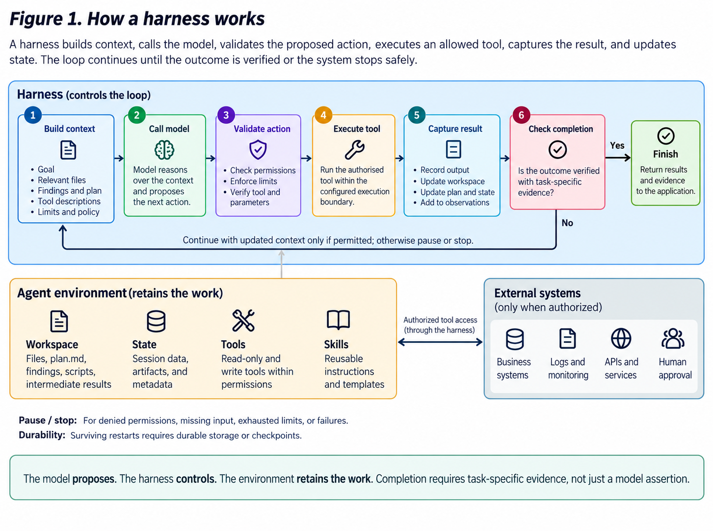
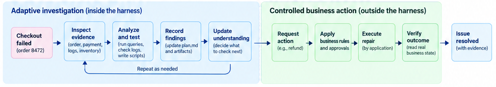

# Agent Harnesses: The Environment for Adaptive, Verified Work

_Part 3 of the model-to-harness series. It follows
[Part 1: From Models to Harnesses](https://www.linkedin.com/pulse/from-models-harnesses-how-ai-agents-learn-finish-job-penumatsa-g2mjc)
and
[Part 2: Agent Frameworks](https://www.linkedin.com/pulse/agent-frameworks-model-can-answer-workflow-finish-penumatsa-sdz6c),
but this article is designed to stand on its own._

## When the goal is clearer than the path

> **Checkout failed for order 8472. Investigate the issue, safely resolve it,
> and show the evidence.**

The goal is clear, but there is no fixed investigation path. The agent must
inspect the checkout evidence, decide what to check next, and stop when it has
enough evidence or reaches a limit.

In Part 2, we followed a double-charge case through a workflow designed in
advance: investigate, validate, get approval, refund, verify, and notify. An
agent framework works well when the allowed process is already known. The model
can understand language inside the workflow, while application code controls
which steps are allowed.

The checkout case starts with a goal instead of a fixed path. The agent needs
room to choose what to inspect next and continue until it has enough evidence.

It also needs clear limits. "Figure it out" cannot mean access to everything,
running forever, or permission to change business data.

| | Framework emphasis | Harness emphasis |
| --- | --- | --- |
| Starting point | A known or limited process | A goal whose path depends on what the agent finds |
| Main question | What step or route comes next? | What may the agent inspect, use, retain, delegate, and verify? |
| Primary contribution | Clear steps, routes, and state changes | A controlled working environment around the agent loop |
| Completion | The workflow reaches an allowed outcome | Evidence proves the result, or the system clearly explains why it must stop |

This is not an either-or choice. Frameworks can run dynamic agents, and
harnesses can contain workflows. The difference is the main responsibility:

> **A framework coordinates the work. A harness equips the agent to pursue and
> verify the work.**

## The working environment around the loop

An **agent harness** is the working environment around a model-driven loop. It
brings together the context, tools, workspace, coordination, and controls an
agent needs to keep making progress toward a goal.

A model-and-tool loop is the center, not the whole system:

```text
reason -> act -> observe -> repeat
```

The model reasons about the next step. The harness checks policy and
permissions before a tool acts. The result becomes a new observation, state and
context are updated, and the loop repeats. Verification then decides whether
the requested outcome is actually supported.



_Figure 1. The agent loop drives the work. The rest of the harness prepares,
controls, records, and verifies that work._

## The building blocks behind the picture

The diagram is a simple way to think about a harness, not a required product
checklist. A harness may provide these parts directly, combine them from
libraries, or leave some of them to the application and runtime.

| Primitive group | What it contributes |
| --- | --- |
| **Model and agent loop** | Uses the goal and current evidence to choose the next action, call a tool, ask a question, or stop. |
| **Context management** | Chooses the instructions, trusted state, knowledge, and tool results the model needs for one decision. Compaction keeps long tasks within the context limit. |
| **Tools and skills** | Tools read information or perform limited actions. Skills provide reusable instructions and domain guidance; they do not give the agent permission. |
| **Environment** | A workspace, filesystem, code editor, shell, browser, or sandbox gives the agent a place to inspect files and create useful work. Enable only what the task needs. |
| **Coordination** | Sessions, progress events, plans, checkpoints, and limited subagents help work continue or split into smaller investigations. |
| **Permissions and budgets** | Policies, approvals, access rules, time limits, token limits, and call limits control what the agent can do and spend. |
| **Verification** | Checks the final result against real evidence before the task is marked complete. |

Three terms are easy to blur:

- **State** is what is currently true for this task: the goal, facts found, decisions,
  approval status, and saved work.
- **Memory or knowledge** is information saved for later use.
- **Context** is the selected information given to the model for one decision.

A long conversation is not automatically useful context. A checkpoint is not a
business record. A successful tool response does not prove that the requested
result is correct.

The harness selects and organizes the evidence. The application and its
business systems still decide what is actually true.

## Three ways harnesses are delivered

The word _harness_ describes a set of capabilities, not one fixed product
category. Products overlap, but these three forms help explain what your team
still owns.

| Form | You primarily provide | The offering primarily provides |
| --- | --- | --- |
| **Harness framework or SDK** | Application logic, business integrations, operating choices, and how the harness parts are assembled | Agent loops, tools, skills, context features, and reusable controls |
| **Managed harness / Harness-as-a-Service** | Task-specific instructions, tools, skills, policies, and business integration | Most of the harness and the infrastructure that runs it |
| **Finished or general-purpose harness** | The task and its specific context, within the product's controls | A ready-to-use environment for completing a type of work |

These examples show the general shape of each form. They are not a feature
comparison or ranking:

| Form | Examples | Why they fit |
| --- | --- | --- |
| Harness framework or SDK | [Microsoft Agent Framework Harness](https://learn.microsoft.com/en-us/agent-framework/concepts/harness), [Deep Agents](https://docs.langchain.com/oss/python/deepagents/overview), [GitHub Copilot SDK](https://docs.github.com/en/copilot/how-tos/copilot-sdk/features) | Developers assemble or configure an agent environment and connect application-owned capabilities. |
| Managed harness | [Managed Deep Agents](https://docs.langchain.com/langsmith/python/managed-deep-agents-overview), [Claude Managed Agents](https://platform.claude.com/docs/en/managed-agents/overview) | The provider operates the harness and more of the runtime while the application supplies task-specific behavior and integrations. |
| Finished or general-purpose harness | [GitHub Copilot](https://docs.github.com/en/copilot), [Claude Code](https://code.claude.com/docs/en/overview), [Codex](https://openai.com/codex/) | Users work through an assembled product experience with opinionated tools, environments, and controls. |

The important question is not which label is best. It is what your team still
owns: context, integrations, permissions, verification, isolation, saved state,
and operations.

## A checkout case inside the harness

Our
[checkout-recovery MAF implementation](../../harness/checkout-recovery/maf/README.md)
turns the opening request into a limited investigation and controlled recovery.
It is an educational application backed by PostgreSQL-persisted simulated
business systems, not a live payment integration.

The agent may inspect the systems in a different order for each case. It may not
decide business policy or change business data.



_Figure 2. The harness guides the investigation from task intake to evidence.
The application still controls approval, repair, and the final business result._

### 1. Start with a goal, identity, and constraints

A clear Start command creates the case and its business record. The harness
receives the checkout goal and a small, carefully chosen set of tools. It does
not receive tools that can refund a payment, update an order, or change
inventory.

This matters. A prompt that says "do not issue a refund" is useful, but the
stronger control is simple: the investigation agent has no refund tool.

### 2. Let evidence determine the next read

The
[investigation agent](../../harness/checkout-recovery/maf/backend/src/checkout_recovery_maf/maf/investigation.py)
loads a checkout-triage skill and chooses when to inspect the order, payment,
and inventory records. Diagnostic logs are optional. It may give one read-only
inventory check to a small, focused subagent.

This freedom has limits:

- order, payment, and inventory evidence are all required;
- it can delegate the inventory check only once;
- model iterations, function calls, duration, context, and output are limited;
- web search, shell execution, and general operating modes are disabled; and
- the agent must leave a nonempty `plan.md` file in its private workspace.

The plan makes the work easier to inspect, but it is not a command. The
application decides the recovery path from the simulated business records. It
does not execute the model's recommendation directly.

### 3. Pause at the authority boundary

Suppose the evidence shows an expired inventory reservation. If the quantity is
within the configured automatic-recovery limit, application policy can allow
the reservation to be created again. Above that limit, the case goes to manual
review.

A captured-payment refund follows a stricter path. The
[application service](../../harness/checkout-recovery/maf/backend/src/checkout_recovery_maf/application/service.py)
saves an approval request and returns control to the caller. A reviewer records
an approval or denial, including the request identity and reason. A
separate Resume command loads that saved decision.

Chat text is not approval. A tool permission prompt is not the business approval
record. A checkpoint that says "approved" is not permission to move money.

### 4. Repair safely, then verify

An allowed repair uses the same operation ID and request fingerprint for every
matching retry. This lets the example recover when the first response is
uncertain. It does not guarantee that any agent retry will run exactly once.

After the repair, the application reloads the saved business state and checks
the order, payment, inventory, and repair records.

The meaning of resolution depends on the remedy:

- inventory recovery expects a confirmed order, authorized payment, reserved
  inventory, and an applied remediation;
- refund resolution expects a cancelled order, refunded payment, released
  inventory, and an applied remediation.

Both are valid, verified results. Neither should be reduced to the vague claim
"the order is healthy." If the evidence does not match the expected result, the
case goes to manual review instead of being shown as successful.

The detailed branches and evidence checks are documented in the
[business rules](../../harness/checkout-recovery/maf/docs/design/business-rules.md)
and
[architecture](../../harness/checkout-recovery/maf/docs/design/architecture.md).
Real payment and inventory systems must still enforce their own permissions,
safe retry rules, checks for uncertain results, and auditing.

## The usual suspects around a harness

Several important concerns affect every stage of the task. They should work
with the harness without being confused with the harness itself.

| Adjacent concern | Boundary to preserve |
| --- | --- |
| **Experience layer** | Shows safe progress, decisions, approvals, and results. It should use clear application commands instead of treating chat as authority. |
| **Memory and knowledge** | Provides selected, controlled information. It must not silently replace current business records. |
| **Observability and evaluations** | Traces explain what happened, and evaluations test behavior across many cases. Neither proves the result for this specific case. |
| **Identity, security, and governance** | Defines who is acting, what they can access, which rules apply, and how actions are audited. Harness permissions do not replace permissions in business systems. |
| **API gateway** | Applies authentication, traffic, quota, and content rules at an integration boundary. It does not prove that a business action worked. |
| **MCP, A2A, and AG-UI** | Standardize tool, agent, and UI communication. They do not define the application's approval rules or completion checks. |

The safest architecture keeps the responsibilities visible:

> **Framework coordinates execution.**
>
> **Harness equips and verifies execution.**
>
> **Runtime provides the infrastructure where the work runs.**
>
> **Application and business systems define what success means.**

## What keeps the work alive

Suppose the reviewer returns tomorrow after the worker restarts. The application
still needs the case, pending request, recorded decision, operation ID, and
business evidence. The harness also needs somewhere to run and, when needed,
restore its task state.

That leads to the next layer: runtime infrastructure.

[Article 4: Runtime Infrastructure](04-runtime-infra.md) follows the same case
across local, self-hosted, and managed hosted-agent environments. The harness
defines how the agent works. The runtime determines where it runs, what it can
reach, how it is isolated, and how it continues after an interruption.

## References and further reading

- [Part 1: From Models to Harnesses](https://www.linkedin.com/pulse/from-models-harnesses-how-ai-agents-learn-finish-job-penumatsa-g2mjc)
- [Part 2: Agent Frameworks](https://www.linkedin.com/pulse/agent-frameworks-model-can-answer-workflow-finish-penumatsa-sdz6c)
- [Microsoft Agent Framework Harness](https://learn.microsoft.com/en-us/agent-framework/concepts/harness)
- [Deep Agents overview](https://docs.langchain.com/oss/python/deepagents/overview)
- [GitHub Copilot SDK features](https://docs.github.com/en/copilot/how-tos/copilot-sdk/features)
- [Managed Deep Agents](https://docs.langchain.com/langsmith/python/managed-deep-agents-overview)
- [Claude Managed Agents](https://platform.claude.com/docs/en/managed-agents/overview)
- [Model Context Protocol](https://modelcontextprotocol.io/specification/latest)
- [A2A Protocol](https://a2a-protocol.org/latest/)
- [AG-UI](https://docs.ag-ui.com/)
