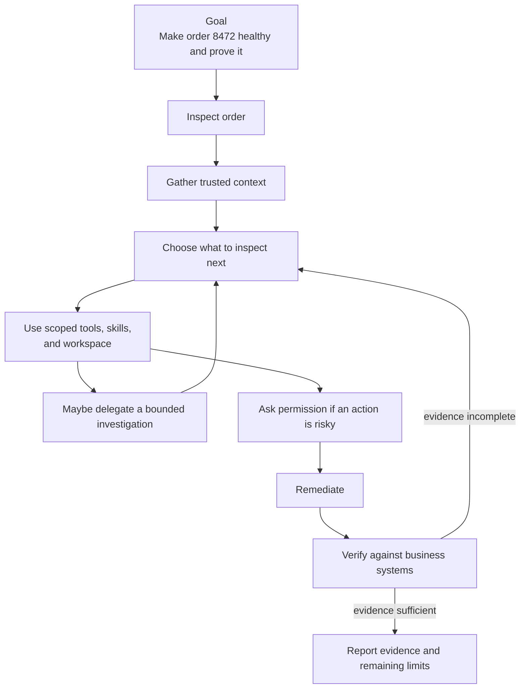

# Agent Harnesses: The Environment for Adaptive, Verified Work

## 1. Why: from coordinated workflows to goal-oriented work

[Part 2](02-agent-frameworks.md) followed a double-charge case through a
known business process: investigate, validate, obtain approval, refund, verify,
and notify. Microsoft Agent Framework (MAF) and LangGraph coordinated that
work through explicit steps, state changes, approval boundaries, and failure
routes.

That is exactly the right design when the permitted workflow is largely known
ahead of time. The model can help interpret a complaint or draft a
notification, but the application defines which transitions are allowed.

Some work begins somewhere different. Consider this request:

> **Checkout failed for order 8472. Investigate the issue, safely resolve it,
> and prove that the order is healthy.**

The goal is clear, but the investigation is not. Is the order invalid, is the
payment still pending, did inventory reservation expire, did a promotion fail,
or is a downstream service unavailable? The right next step depends on
evidence the agent does not yet have.

> **Framework:** “We know the workflow. Coordinate it reliably.”
>
> **Harness:** “We know the goal. Give the agent what it needs to figure out
> the path.”

This is a difference in emphasis, not an absolute split between deterministic
and nondeterministic systems. Frameworks can support model-directed routing and
agent loops; harnesses can contain pre-structured workflows. In this series,
frameworks emphasize **pre-structured coordination**, while harnesses emphasize
**adaptive goal pursuit inside a controlled operating environment**.

The question changes from “what node comes next?” to “what may the agent
inspect, change, delegate, retain, and use as proof of completion?”

## 2. What: the agent harness

An **agent harness** is the execution and working shell around a model/agent
loop that enables repeated, stateful, tool-using work toward a goal. It is the
controlled environment in which the agent can inspect, act, delegate, verify,
and continue.

A loop that alternates model calls and tool calls is necessary, but it is not
enough. Long-running work also needs an appropriate working context, useful
capabilities, bounded authority, artifacts, a record of progress, and a way to
determine whether the requested outcome is actually true.

```text
Goal
  -> assemble relevant context
  -> choose a permitted next action
  -> execute through an appropriate capability
  -> record useful progress and artifacts
  -> verify the observed outcome
  -> continue, ask for input, escalate, or report
```

The harness does not decide business truth by itself. An e-commerce application
still owns what “order healthy” means: for example, a valid order state, the
intended payment state, an appropriate inventory reservation, and any required
customer communication. The harness equips the agent to reach and check that
definition; the business systems supply the authoritative evidence.

Three related terms should remain separate:

| Term | Meaning in this article |
| --- | --- |
| **State** | Current execution truth, such as the goal, facts found, selected next actions, approval status, and artifacts. |
| **Memory / knowledge** | Deliberately retained information that may be selected for a later task or decision. |
| **Context** | The bounded projection of instructions, trusted state, selected knowledge, and tool results supplied to one model decision. |

Neither a long chat transcript nor a successful tool response proves that the
goal has been met. Context is selected; it is not an unlimited dump of
conversation history, logs, files, or customer data.

## 3. Anatomy: five small buckets

The terms below are a mental model, not a required product checklist. A
particular harness may provide some primitives directly, compose them from
libraries, or leave them to the application and runtime.

| Bucket | Core primitives | What it contributes |
| --- | --- | --- |
| **Reasoning and control** | Model, agent loop/orchestrator, context management | Turns a goal and selected evidence into a proposed next action. |
| **Capabilities** | Tool registry/execution, skills, browser/search, code editor and shell | Lets the agent retrieve information or perform bounded work beyond text generation. |
| **Environment** | Workspace and filesystem | Gives work a place for task files, plans, patches, collected evidence, and inspectable artifacts. |
| **Coordination** | Session/state, subagents, progress events | Carries a task across decisions and, where appropriate, distributes bounded work. |
| **Safety and completion** | Permissions, policy, approvals, verification | Constrains authority and makes completion depend on evidence rather than model confidence. |

A few mechanisms commonly sit within those buckets but should not distract from
the story:

- **Compaction or summarization** helps preserve the useful task record when
  history exceeds the available context window. It is a lossy context-management
  choice, not an authoritative audit record.
- **Sandboxing and execution isolation** constrain where shell commands,
  generated code, and browser automation can run. The right boundary depends
  on the task and its data.
- **Events and checkpoints** can expose progress and resume an interrupted
  task. Their durability and semantics depend on the implementation. A
  checkpoint is not a replacement for business state.

The checkout request needs every bucket, but not every primitive at once. The
important design question is always: *what does the next safe investigation
step require?*

## 4. Three ways harnesses show up

The word *harness* describes a capability shape, not a settled industry product
category. The following forms are useful for orientation:

| Form | You primarily provide | The offering primarily provides |
| --- | --- | --- |
| **Build your own harness** | The application, business rules, integrations, operating choices, and the assembly of harness primitives. | SDKs, agent abstractions, tools, and reusable components. |
| **Managed harness** | The goal-specific instructions, tools, skills, and business integration. | Much of the harness and its execution infrastructure. |
| **Finished/general-purpose harness** | A task and task-specific context, within product controls. | An opinionated, assembled experience for users to perform work. |

These forms overlap. An SDK may include an opinionated harness agent; a
finished product can expose an SDK; a managed offering can permit
application-defined tools and execution environments. The useful question is
not which label wins, but which responsibilities remain yours: context,
authority, environment, verification, and runtime operation.

## 5. The checkout investigation: adaptive work in a controlled environment

Return to order 8472. A framework could coordinate an investigation graph if
the diagnosis and remediation paths had already been designed. A harness starts
with a narrower commitment: it gives the agent a controlled way to discover
which path is justified.



The arrows describe an investigation, not a promise that a harness should
generate an unrestricted loop. Each turn has a purpose and a boundary.

### Start with trusted order facts

The agent first uses a scoped order lookup. It receives the order identifier,
its current status, the customer-visible checkout error, and correlation IDs
that can be used to inspect related systems. The harness places these selected
facts, not the complete commerce database, into the next decision context.

At this point, the agent should be able to say what it knows and what it needs
next. It should not claim that a payment, inventory, or order is healthy merely
because the order lookup succeeded.

### Let the evidence determine the next inspection

The order record might show a `payment_pending` state. That makes payment
status and gateway logs relevant. If it shows `inventory_unavailable`, an
inventory reservation is the better next target. A correlation ID may make
application traces useful. A customer-facing reproduction might make browser
state relevant.

This is where harness capabilities matter:

| Investigation need | Harness capability | Control that still matters |
| --- | --- | --- |
| Determine the current order and payment state | Typed, scoped business-system tools | Tool identity and downstream authorization must permit only the requested read. |
| Find why checkout failed | Log/search tools or a browser, with selected correlation data | Treat retrieved content as data; do not turn logs or web content into instructions. |
| Follow a repeatable diagnosis procedure | A checkout-triage skill | A skill is guidance, not an authority grant or proof of correctness. |
| Compare findings and maintain a repair plan | Workspace and filesystem artifacts | Keep task files within the workspace and protect customer data according to policy. |
| Inspect a repository, configuration, or safe diagnostic script | Code editing and shell execution, where needed | Run within the intended sandbox and permission boundary. |
| Separate an independent log or inventory investigation | A bounded subagent task | Give the child a narrow goal, scoped tools, and a result the parent verifies. |

For example, the parent agent may ask a read-only subagent to summarize payment
gateway errors for the order's correlation ID while it checks inventory. The
parent does not inherit a conclusion as fact. It compares the returned summary
with the authoritative payment and order records before choosing a remedy.

### Use a workspace to make progress inspectable

The workspace is not merely a convenient folder. It lets the task leave useful
artifacts: an investigation plan, redacted diagnostic queries, a list of
evidence identifiers, a proposed remediation, or a patch for an owned
configuration repository.

Those artifacts support continuation and review. They also make it easier to
separate a safe summary from unrestricted raw tool arguments, tool results,
prompts, credentials, or checkpoint payloads. A UI can project progress and
safe decision summaries; it should not receive all of the harness's internal
context.

### Pause at the authority boundary

Suppose the evidence shows that payment was captured but inventory reservation
expired. Recreating a reservation may be permitted under a bounded inventory
policy. Issuing a customer refund, changing a payment, or overriding an order
may need a human or policy-approved decision.

The harness therefore asks for approval through an explicit, durable command
boundary. It records the proposed action, the applicable evidence summary, and
the decision needed to proceed. It does not infer approval from chat text or
keep a worker blocked while waiting.

The exact business control belongs to the application and downstream systems.
As in Part 2, a consequential side effect needs its own authorization and
idempotency contract. A harness permission prompt is useful control at the
agent boundary; it does not replace a payment or order service's authorization
checks.

### Verify the business outcome, then report it

After remediation, the agent checks the systems that define success. For this
illustrative checkout case, the report might need evidence that:

1. the authoritative order record is in a valid state;
2. the payment service reports the intended final payment state and has no
   unintended duplicate charge or refund;
3. inventory shows the expected reservation or allocation;
4. the diagnostic condition is resolved or has been explicitly escalated; and
5. any customer-facing notification has the expected delivery state.

The final output is therefore an evidence-backed result, such as “order is
healthy; here are the order, payment, and inventory evidence identifiers,” or
“the investigation reached a manual-review boundary; no refund was issued.”
It is not “the model believes the plan is complete.”

An independent [checkout-recovery MAF implementation](../../harness/checkout-recovery/maf/README.md)
implements a bounded version of this scenario. Its
[harness investigation](../../harness/checkout-recovery/maf/backend/src/checkout_recovery_maf/maf/investigation.py)
uses model-selected read tools, a triage skill, a scoped workspace, and optional
delegation. The [application service](../../harness/checkout-recovery/maf/backend/src/checkout_recovery_maf/application/service.py)
owns policy, durable approval/resume, and verification against PostgreSQL-persisted
simulated business records. General shell and browser capabilities are deliberately
disabled. The [delivery ledger](../../harness/checkout-recovery/maf/docs/design/issues-changes-fixes.md)
distinguishes demonstrated local and Foundry behavior from future hardening.
The Part 2 [MAF](../../agent-framework/double-charge/maf/README.md)
and [LangGraph](../../agent-framework/double-charge/langgraph/README.md)
applications remain examples of the earlier, pre-structured workflow layer;
they are not presented here as an order-8472 harness.

## 6. Ecosystem: orientation, not a taxonomy debate

The table maps current offerings to the three explanatory forms above. It is
not an adoption ranking or a claim that any product provides every primitive in
this chapter.

| Offering | Fitting form(s) | Orientation |
| --- | --- | --- |
| [Microsoft Agent Framework](https://learn.microsoft.com/en-us/agent-framework/concepts/harness) | Build your own; packaged harness capability | Its agent, workflow, and Harness Agent capabilities span more than one layer. |
| [Deep Agents](https://docs.langchain.com/oss/python/deepagents/overview) | Build your own | Provides an agent approach for planning, subagents, and filesystems. |
| [GitHub Copilot SDK](https://docs.github.com/en/copilot/how-tos/copilot-sdk/features) | Build your own | Exposes sessions, an agent loop, tools/MCP, skills, hooks, events, and scoped subagents for host applications. |
| [Managed Deep Agents](https://docs.langchain.com/langsmith/python/managed-deep-agents-overview) | Managed | LangChain distinguishes the Deep Agents harness from its managed Agent Server runtime. |
| [OpenAI Agents API](https://developers.openai.com/api/docs/guides/agents) | Managed | OpenAI documents this as running a managed Codex harness; its separate Agents SDK is application-run. |
| [Claude Managed Agents](https://platform.claude.com/docs/en/managed-agents/overview) | Managed | Anthropic describes a pre-built, configurable harness in managed infrastructure. |
| [Codex](https://openai.com/codex/) | Finished/general-purpose | An opinionated coding-agent experience; use its current documentation for surface and availability details. |
| [Claude Code](https://code.claude.com/docs/en/overview) | Finished/general-purpose | An agentic coding tool for codebase, file, command, and development-tool work. |
| [GitHub Copilot](https://docs.github.com/en/copilot) | Finished/general-purpose | A user-facing product that spans chat, coding, and agentic experiences. |
| [ChatGPT Work](https://help.openai.com/en/articles/20001275-chatgpt-work-and-codex) | Finished/general-purpose | OpenAI describes Work as an agent for longer, multi-step work and finished deliverables. |

The runtime underneath these offerings is a separate choice. For example, a
managed product may operate both its harness and runtime, while an SDK lets an
application assemble a harness that runs in its own chosen environment. Product
names and capabilities change quickly, so this map should be rechecked against
the linked first-party material before publication.

## 7. Boundaries: what a harness does not automatically solve

Harnesses integrate closely with surrounding concerns, but integration does not
erase responsibility boundaries.

| Adjacent concern | Boundary to preserve |
| --- | --- |
| Experience layer | Presents safe progress, approvals, and results; it does not become the authoritative business command path. |
| Memory and knowledge | Supplies selected, governed knowledge; it does not silently override current system-of-record facts. |
| Observability and evals | Show what was observed and test behavior; neither establishes business truth for one live order. |
| Identity, security, and governance | Define who acts, data access, and policy; harness permissions do not replace downstream authorization. |
| API gateway | Protects traffic and ingress policy; it does not verify the effect of a business operation. |
| MCP, A2A, and AG-UI | Enable tool, agent, or UI interoperability; they do not define the application's approval or completion semantics. |

The division of responsibilities remains:

> **Framework coordinates execution.**
>
> **Harness equips and verifies execution.**
>
> **Runtime provides the execution substrate.**
>
> **Application and business semantics define what success means.**

Runtime recovery does not imply business correctness. Checkpoints do not replace
business state. A model or harness can summarize evidence, but the authoritative
order, payment, inventory, and policy systems must establish the outcome where
that evidence matters.

## 8. Next: the runtime beneath the harness

A harness determines how an agent receives context, works with capabilities,
stays within controls, and checks its result. It still needs somewhere to run:
locally on a developer machine, on self-hosted infrastructure, or in a managed
hosted-agent environment.

> **The harness defines how the agent works. The runtime defines where that harness executes and how execution survives.**

[Article 4: Runtime Infrastructure](04-runtime-infra.md) follows the same checkout
investigation through local, self-hosted, and managed hosting arrangements,
distinguishing architecture and code pointers from verified deployment evidence.
