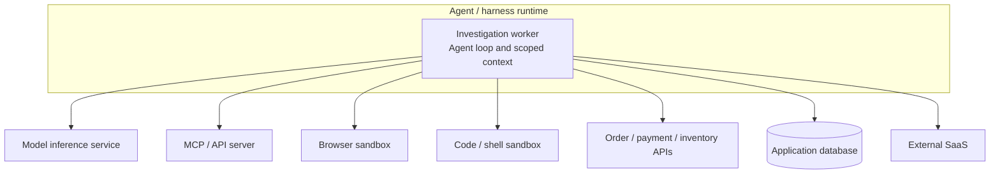
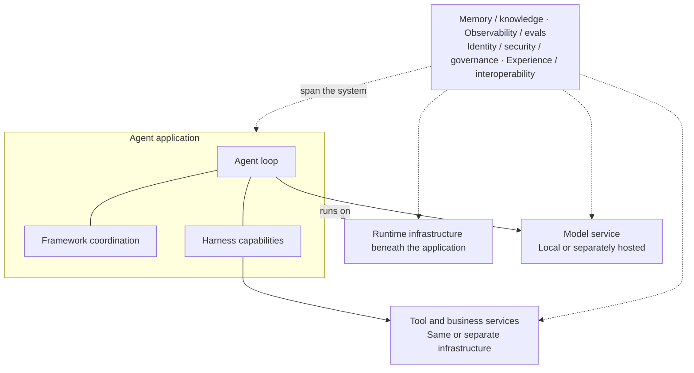

# Runtime Infrastructure: Where Agentic Work Runs

## 1. Why: from harness to infrastructure

[Article 3](03-agent-harnesses.md) introduced a checkout investigation:

> **Checkout failed for order 8472. Investigate the issue, safely resolve it,
> and prove that the order is healthy.**

The harness equips the agent to inspect evidence, choose a permitted next
action, use tools, maintain a workspace, and ask for approval. But that software
still needs somewhere to run.

Where does its worker execute? How does it reach the payment service? Where does
the investigation's progress live when the process stops? What happens when ten
investigations become a thousand?

Those are runtime infrastructure questions. They apply whether the application
uses a pre-structured framework workflow, an adaptive harness, or a small custom
agent loop.

> **Runtime is infrastructure: it determines where agentic work runs, what it
> can reach, what is isolated, and how execution is recovered and scaled.**

For this chapter, keep the checkout goal unchanged. We are changing the
operating arrangement around the work, not the definition of a healthy order.

## 2. What: runtime is the execution substrate

> **Runtime is the infrastructure substrate where agent, framework, and
> harness code executes.**

Here, *runtime* means the hosting substrate and supporting platform services,
not just the Python interpreter or a framework's in-process runner.

```text
Framework = coordinates work
Harness   = equips the agent
Runtime   = infrastructure that runs the code
Business  = defines success
```

The developer implements the business contract in application code. The harness
can investigate a pending payment, and the runtime can keep its worker running.
Neither can declare that payment settled without authoritative evidence.

Also distinguish the **agent process** from **model inference**. A local Python
process can run the agent loop while calling a model hosted elsewhere. Moving
that process into a managed agent service changes its hosting; it does not
necessarily move the model, payment service, or database with it.

## 3. Three forms: local, self-hosted, and managed

These are three useful operating models, not a maturity ladder:

```text
                       Agent / harness application
                         /         |          \
                      Local    Self-hosted    Managed
```

**Local** means the agent application runs on a developer or operator machine.
Its model and business services can still be remote.

**Self-hosted** means your team operates the agent application on infrastructure
it selects. That can include VMs, Kubernetes, or a managed container platform
such as Azure Container Apps. You need not own the physical servers.

**Managed** means an agent platform takes responsibility for more of the hosting
and lifecycle. Some platforms host your code; others also supply their own
harness. That distinction matters when discussing portability.

For a platform that hosts your application code, ownership commonly looks like
this. The exact service contract still takes precedence:

| Responsibility | Local | Self-hosted application | Managed agent hosting |
| --- | --- | --- | --- |
| Compute and workers | You start and stop local processes. | You deploy the application; the selected platform supplies compute. | Provider runs workers within its supported configuration. |
| Networking | You configure local access to dependencies. | You configure ingress, egress, service connectivity, and platform networking. | Provider supplies supported connectivity mechanisms; you configure permitted access. |
| Storage services | You choose local or remote stores and their durability. | Your team selects and operates stores, possibly using managed databases. | Provider may operate session/artifact stores; external business databases remain separately owned. |
| Scaling | You control process count and local capacity. | You configure scaling policy and capacity on the selected platform. | Provider implements supported scaling; you still account for quotas and downstream capacity. |
| Recovery | You restart processes and arrange continuation. | You configure supervision, health checks, and recovery integration. | Provider supplies its lifecycle/recovery mechanisms; safe application continuation remains necessary. |
| Upgrades | You maintain the local environment and packages. | You maintain application releases and the platform layers you own. | Provider maintains its platform; your application dependencies and compatibility remain your responsibility. |
| Isolation | You choose process, container, or sandbox boundaries. | You configure workload, network, and tenant separation. | Provider supplies documented boundaries; your configuration and application access controls still matter. |

[Azure Container Apps](https://learn.microsoft.com/en-us/azure/container-apps/overview)
and [AKS](https://learn.microsoft.com/en-us/azure/aks/what-is-aks) are themselves
managed services. In this comparison, *self-hosted* describes who operates the
agent application, not an assertion that every infrastructure layer is unmanaged.

For order 8472, the practical question is not "which label is best?" It is
"who keeps this investigator available, connected, isolated, and recoverable?"

## 4. Anatomy: the infrastructure the checkout investigation needs

Each primitive answers an operating question raised by the case:

| Primitive | Checkout question |
| --- | --- |
| Compute | Where does the investigator's code run? |
| Process/worker lifecycle | Who starts it, checks its health, stops it, and replaces it? |
| Networking and egress | Can it reach the model, order service, payment service, and approved tools? |
| Identity and secrets | Which workload is calling, and how does it obtain narrowly scoped access? |
| Storage services | Which databases or file stores retain case records, framework progress, and task artifacts? |
| Isolation/sandbox | What separates this investigation from other tasks and limits executable tools? |
| Recovery | How is execution restored after a worker or connection is lost? |
| Scaling | How is capacity added without overwhelming shared dependencies? |

Containers, VMs, and microVMs are compute and isolation implementation choices,
not separate stages in the story. Their boundaries differ. A container is not
automatically an adequate sandbox for arbitrary generated code.

Storage services provide durable storage when configured for it. Frameworks
define what checkpoints mean; applications define what business records mean.
A checkpoint does not replace authoritative business state, and hosting an
in-memory workspace in the cloud does not make it durable.

For example, restarting the checkout investigator does not authorize a pending
refund. The application must still check the recorded approval before proceeding.

**Runtime hosts, restarts, and scales execution. Framework and application logic
determine how work safely resumes.**

## 5. Execution boundaries: agent runtime is not tool runtime

The agent's process does not have to execute every tool itself. A browser,
shell, MCP server, database, and payment service can all live behind different
infrastructure and security boundaries.



Each external box represents a possible separate boundary, not a required
deployment component. A tool can also be an ordinary function in the worker's
process. This diagram is architectural: it does not claim the checkout demo
implements every connection shown.

Follow one payment inspection:

1. The harness selects a permitted payment-status tool for the current case.
2. The tool executes locally or sends a request to its own server.
3. Network policy allows the connection, and the downstream service authorizes
   the caller and requested operation.
4. The result returns to the harness as selected evidence for its next decision.

A tool being listed in the harness does not grant access to its downstream
systems. Conversely, reaching a service over the network does not authorize
every operation on it.

MCP specifies how a tool integration communicates; it does not specify where
the server runs or make its tools safe. A browser sandbox limits browser
execution, not necessarily the permissions of the payment API it can reach.

This is why agent hosting and tool hosting must be considered separately.
Moving the harness into managed infrastructure does not automatically move,
secure, or operate every connected capability.

## 6. Demo architecture: the same checkout investigation, three arrangements

Return to order 8472. The investigation still needs to inspect the order,
understand payment and inventory evidence, respect approval requirements, and
verify the business result.

**This section is an architecture walkthrough, not a three-platform deployment
report.** The independent
[checkout-recovery MAF lane](../../harness/checkout-recovery/maf/README.md)
is under development. Its code provides concrete reference points, but the
presence of code or deployment configuration does not establish end-to-end
acceptance across all three hosting models.

### Local: run the investigator near the developer

The application process runs on the developer's machine. It may still use a
remote model and PostgreSQL. Starting locally is useful for understanding the
case and inspecting the application boundaries without adding a cloud release
to the first learning step.

The lane's
[bootstrap](../../harness/checkout-recovery/maf/backend/src/checkout_recovery_maf/bootstrap.py)
selects the investigator and repository. It distinguishes scripted execution
from MAF execution and in-memory storage from PostgreSQL.

For a comparison of the same harness, select the MAF investigator rather than
treat a scripted test as equivalent model-driven execution. Likewise, use
durable storage when demonstrating progress across process loss; an in-memory
test does not establish that guarantee.

The
[MAF investigation code](../../harness/checkout-recovery/maf/backend/src/checkout_recovery_maf/maf/investigation.py)
provides scoped diagnostic functions, a triage skill, a workspace, and bounded
inventory delegation. Its diagnostic tools read the teaching simulator in the
application process. The browser, remote MCP, and shell boundaries shown earlier
are possible extensions, not demonstrated runtime components of this lane.

### Self-hosted: operate the application on a selected platform

Now place the application on infrastructure your team operates. The business
goal remains the same, but a local process command becomes a deployed worker
or service with ingress, health checks, workload access, and configured storage.

The checkout lane's
[infrastructure templates](../../harness/checkout-recovery/maf/infra/README.md)
describe a Container Apps arrangement with a public frontend, private API,
PostgreSQL, and supporting services. This is a code pointer to the intended
hosting topology, not proof that a particular environment has been deployed.

Your team must decide how workers reach the model and stores, which identities
they use, and what happens when replicas restart or scale. VMs and AKS are
alternative infrastructure examples, not additional implemented checkout
deployment targets.

More replicas do not automatically make the business operation safer.
Application idempotency, concurrency controls, and downstream capacity must
still support the chosen scaling policy.

### Managed: let an agent platform operate the hosting

[Foundry Hosted Agents](https://learn.microsoft.com/en-us/azure/foundry/agents/concepts/hosted-agents)
is the concrete bring-your-code example. The platform operates the agent
hosting and supported lifecycle; your application retains its investigation
logic and business controls.

The lane's
[hosted adapter](../../harness/checkout-recovery/maf/infra/foundry-hosted/agent/main.py)
connects the Responses transport to `CheckoutRecoveryService` and the MAF
investigator. Start, approval, and resume remain explicit commands.
The [deployment configuration](../../harness/checkout-recovery/maf/azure.yaml)
and [packaging script](../../harness/checkout-recovery/maf/scripts/prepare_hosted.py)
describe how that code is prepared for hosting.

These are existing integration surfaces, not evidence of a verified hosted
release. A complete demonstration must separately establish the deployed
artifact, connectivity, permissions, persistence, and successful business
scenarios. The earlier double-charge deployment does not establish checkout
acceptance.

### What stays the same, and what changes?

| Preserve the contract | Adapt the operating arrangement |
| --- | --- |
| Checkout goal and business success criteria | Compute owner and worker lifecycle |
| Investigation logic and permitted tool contracts | Entrypoint and transport adapter |
| Explicit approval and remediation rules | Workload identity, credentials, and network paths |
| Idempotency and verification requirements | Storage configuration and supported persistence |
| Evidence-backed customer report | Scaling policy, quotas, isolation, and tool environments |

The aim is the same harness behavior under a different hosting arrangement,
not identical configuration or an assurance that every platform accepts the
same package. Validate supported capabilities rather than assume portability.

## 7. Ecosystem and boundaries: what is actually being managed?

Keep local, self-hosted, and managed infrastructure as the organizing model.
The examples below are orientation, not a ranking. For managed offerings, ask
whether the provider hosts your code, supplies its own harness, or does both.

| Offering or infrastructure | Orientation |
| --- | --- |
| [Foundry Hosted Agents](https://learn.microsoft.com/en-us/azure/foundry/agents/concepts/hosted-agents) | Managed hosting for custom agent code. |
| [LangGraph / LangSmith deployment options](https://docs.langchain.com/langsmith/deployment) | Agent Server hosting in cloud, self-hosted, or hybrid arrangements. |
| [Managed Deep Agents](https://docs.langchain.com/langsmith/python/managed-deep-agents-overview) | Deep Agents harness plus managed hosting. |
| [Claude Managed Agents](https://platform.claude.com/docs/en/managed-agents/overview) | Configurable provider harness plus managed infrastructure. |
| [OpenAI Agents API](https://developers.openai.com/api/docs/guides/agents-api/overview) | Managed Codex harness; distinct from the application-run Agents SDK. |
| [ACA](https://learn.microsoft.com/en-us/azure/container-apps/overview), [AKS](https://learn.microsoft.com/en-us/azure/aks/what-is-aks), and [Azure VMs](https://learn.microsoft.com/en-us/azure/virtual-machines/overview) | Infrastructure on which your team operates the agent application. |

These are not interchangeable destinations for unchanged MAF code. In
particular, choosing a provider's managed harness can change more than the
infrastructure. Check its behavior, tool contracts, and environment options
instead of treating it as a neutral hosting swap.

Infrastructure security belongs in this chapter as concrete boundaries:
permitted network destinations, workload identity, secret delivery, executable
tool sandboxes, and tenant/session isolation. Application authorization and
downstream access checks remain necessary even when the provider operates the
host. The later security/governance chapter examines the broader policies.

For checkout, a platform can restart the investigator, preserve supported
session data, and allocate another worker. It cannot establish that the
payment, inventory reservation, or order state is correct.

**Runtime recovery does not imply business correctness.**

## 8. The execution picture is complete; the concerns cross it

The first four articles now describe model capabilities, agents that act,
frameworks that coordinate, harnesses that equip, and infrastructure that runs
the application.

The picture is a set of cooperating responsibilities, not a mandatory upgrade
chain:



A small application need not use every component as a separate library or
service. Likewise, introducing a harness does not make its runtime the next
level of intelligence. Runtime was underneath the code all along.

> **Runtime is infrastructure: it determines where agentic work runs, what it
> can reach, what is isolated, and how execution is recovered and scaled.**

Next, Article 5 turns to **memory and knowledge**: what should be retained,
retrieved, and supplied to the next decision? Later chapters examine
**observability and evaluations** and **identity, security, and governance**.
Experience and interoperability connect those responsibilities across the
system rather than becoming another mandatory layer.

Hosting makes execution possible. Business evidence still determines whether
the job is finished.

## References and reading boundary

The linked provider documentation describes platform capabilities, not a
certification of the checkout implementation. Recheck product availability,
supported environments, isolation, and persistence contracts before choosing a
deployment.

The repository code pointers describe the source available while this chapter
is being developed. The checkout investigation uses teaching simulators;
real payment processing, arbitrary-code sandbox safety, and three-runtime
deployment acceptance are not claims made by this article.
