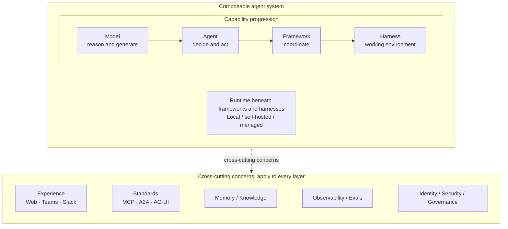

# From Models to Harnesses: How AI Agents Learn to Finish the Job

## The next breakthrough may not be a smarter model

We now call almost everything an _agent_: chatbots, copilots, coding assistants, research tools, workflows, and managed agent platforms. The word is useful, but it hides the more important change underneath.

AI is moving from **answering questions** to **taking actions** to **carrying work across time and tools**: reaching a checked result that people can trust.

A model alone is not a working system. It can reason and generate, but it cannot reliably gather current information, operate tools, preserve progress, wait for approval, recover from failure, or prove that work was completed correctly.



These are composable capability layers, not mandatory upgrade stages. A framework-based application may already be the right production architecture; a harness becomes useful when a task needs a richer, persistent working environment. Every framework and harness runs somewhere, but a runtime is the execution substrate beneath them, not the final maturity step.

> **Framework = how work is coordinated. Harness = what surrounds the agent so it can finish and verify the work. Runtime = where that work executes and survives.**

> **A case to follow — the double charge.** A customer says they were billed twice. Resolving the case means checking the account and billing records, validating policy, obtaining approval, issuing one refund, notifying the customer, and retaining evidence.

## What each layer adds

At every transition, ask what the preceding layer still lacks:

```text
Model
↓ Can reason, but cannot act.

Agent
↓ Can act, but complex work becomes hard to coordinate.

Framework
↓ Can coordinate durable workflows, but does not necessarily provide
  a complete task environment.

Harness
  Provides context, tools, permissions, workspace, and verification.
```

Underneath the framework and harness, the runtime executes the work; durability, isolation, recovery, and scaling depend on its implementation.

## 1. Model: smart, but empty-handed

Foundation models made language and reasoning programmable. They can summarize, draft, classify, explain, plan, and generate code, but they only see the context supplied for the current request. They do not automatically know today’s account balance, open a billing system, or preserve meaningful progress.

> **Double charge:** with the complaint in context, the model can draft a helpful response. It cannot confirm the duplicate charge or return money.

## 2. Agent: now it can act

An agent wraps a decision loop around a model:

```text
Observe → Reason → Act → Reflect → Continue or stop
```

The agent receives instructions and current context, then responds, calls a tool, asks for clarification, or stops. Tool results become input to the next decision. Here, **reflect** means checking what happened and deciding what to do next; it does not imply autonomous self-improvement.

> **Double charge:** the agent can retrieve the account, compare transactions, and draft a refund request. A simple loop still makes parallel checks, approval waits, recovery, and safe side effects difficult to coordinate.

## 3. Framework: coordinating control flow and state

Small custom loops are easy to understand. Production work introduces recurring needs: typed messages, tool schemas, validation, streaming, error handling, explicit state, and human intervention. SDKs package many of these building blocks; frameworks add explicit control flow and stateful orchestration.

Frameworks include [LangGraph](https://docs.langchain.com/oss/python/langgraph/overview), [Microsoft Agent Framework](https://learn.microsoft.com/en-ca/agent-framework/?view=agent-framework-python-latest), [CrewAI](https://docs.crewai.com/), and [Google ADK](https://google.github.io/adk-docs/). Agent SDKs such as the [OpenAI Agents SDK](https://openai.github.io/openai-agents-python/) and [Claude Agent SDK](https://platform.claude.com/docs/en/agent-sdk/overview) provide reusable agent building blocks. Product boundaries overlap; the useful distinction is the capability being used.

Common framework capabilities include:

- **Workflow:** steps, branches, and loops.
- **State:** explicit execution truth and its transitions.
- **Interrupts:** durable pauses for approval, clarification, or external events.
- **Failure handling:** retries, timeouts, cancellation, and error routing.
- **Checkpoints:** resume and recovery from a known state.

> **Double charge:** the framework coordinates investigation, the policy check, an approval pause, a retry-safe refund, and notification. It makes the order, branches, and recovery behavior explicit.

**A framework defines how work moves:** steps, branches, state transitions, approvals, retries, and checkpoints. But coordinating work does not necessarily give an agent the complete environment needed to operate across documents, repositories, browsers, business systems, and artifacts.

**A harness assembles that working environment:** context management, skills, tools, permissions, workspace, execution capabilities, and outcome verification.

**The runtime sits underneath both**, providing the infrastructure that executes the system, isolates it, preserves it across pauses, and restores it after interruption.

## 4. Harness: the working environment for finishing work

A harness assembles the working environment an agent needs to finish and verify a task.

```text
Goal
  ↓
Build context
  ↓
Model chooses action
  ↓
Policy authorizes
  ↓
Tool executes an authorized action
  ↓
Update state + artifacts
  ↓
Verify
  ├─ not done → continue
  └─ done → outcome
```

Three terms should remain distinct. **State** is the current execution truth: the plan, completed steps, errors, and approval status. **Memory** is selected knowledge retained for later use. **Context** is the temporary projection shown to the model for one decision.

Skills describe reusable procedures; tools act through APIs, browsers, code execution, and business systems. The workspace contains the task’s repository, case files, documents, or artifacts. Before execution, the harness checks identity, policy, permission, approval requirements, and the execution boundary.

> **Double charge:** the harness assembles the complaint, account data, policy, and case state; waits for approval; executes the protected refund action; and verifies that exactly one refund occurred before closing the case.

A framework can complete real work without being called a harness. A harness becomes valuable when the work needs a richer environment spanning context, tools, artifacts, approvals, and verification over time.

## 5. Runtime: executing and sustaining the work

The runtime executes the agent system. Depending on its implementation, it may also provide sessions, workers, queues, persistence, isolation, scheduling, recovery, and scaling. It may be local, self-hosted, or managed.

Managed hosted-agent platforms such as [Microsoft Foundry Hosted Agents](https://learn.microsoft.com/en-us/azure/foundry/agents/concepts/hosted-agents), [Claude Managed Agents](https://platform.claude.com/docs/en/managed-agents/overview), and [Managed Deep Agents from LangChain](https://docs.langchain.com/langsmith/python/managed-deep-agents-overview) operate some or all of this infrastructure; capabilities vary by platform.

> **Double charge:** the runtime persists the approval wait and restores the workflow later. If the billing API fails, it supports a retry while the idempotency key and business-system verification protect against a second refund.

## 6. Cross-cutting concerns: what makes agency trustworthy

These concerns surround every layer; they are not a final implementation step.

| Concern                                | What it answers                                                                                                                          |
| -------------------------------------- | ---------------------------------------------------------------------------------------------------------------------------------------- |
| **Experience**                         | Where do people review, correct, approve, and receive work: web applications, Teams, Slack, or another channel?                          |
| **Standards**                          | How do systems exchange capabilities without one-off integration: MCP for tools and data, A2A for agents, and AG-UI for user interfaces? |
| **Memory and knowledge**               | What should persist, for how long, under what access controls, and with what provenance?                                                 |
| **Identity, security, and governance** | Who is acting, what can it access, which policies apply, and can the work be reconstructed and controlled?                               |
| **Observability and evals**            | What happened, did the system reach the right outcome safely, and did a change improve it?                                               |

## The real contest

The industry often compares models head-to-head, as though the best model automatically creates the best agentic system. Model quality matters enormously, but dependable work also requires coordination, a suitable task environment, durable execution, and controls around all of them.

The prize is consistency: carrying work to a verified outcome across tool calls, state transitions, failures, approvals, and time. The question for any new “agent” is not only “Which model does it use?” It is:

> **What work can it carry to a finished, trustworthy result; over what time horizon; with whose authority; and with what evidence that it was done correctly?**

## Where this series goes next

This summary is the first of seven articles. The next six deepen the layers and concerns introduced here:

1. **Agent frameworks and orchestration, with code:** equivalent workflows in [Microsoft Agent Framework (MAF)](https://learn.microsoft.com/en-ca/agent-framework/?view=agent-framework-python-latest) and [LangGraph](https://docs.langchain.com/oss/python/langgraph/overview).
2. **Inside the harness for long-horizon tasks:** context, skills, permissions, tools, workspaces, sub agents, and verification.
3. **Runtimes and hosted agents:** sessions, persistence, isolation, scheduling, recovery, and operating choices.
4. **Memory and knowledge:** state, memory, context, retrieval, provenance, retention, and safe updates.
5. **Observability and evaluations:** traces, outcome-based evaluation, release gates, and production monitoring.
6. **Identity, security, and governance:** authority, scoped access, approvals, auditability, policy enforcement, and control of consequential actions.

## Sources and verification

The diagrams and category map in this article are original conceptual models. Product behavior changes quickly, so validate vendor-specific statements, preview status, and limits immediately before publication.

- [Microsoft Agent Framework documentation](https://learn.microsoft.com/en-ca/agent-framework/?view=agent-framework-python-latest)
- [Microsoft Foundry Hosted Agents](https://learn.microsoft.com/en-us/azure/foundry/agents/concepts/hosted-agents)
- [Claude Managed Agents overview](https://platform.claude.com/docs/en/managed-agents/overview)
- [LangChain Managed Deep Agents](https://docs.langchain.com/langsmith/python/managed-deep-agents-overview)
- [LangGraph overview](https://docs.langchain.com/oss/python/langgraph/overview)
- [CrewAI documentation](https://docs.crewai.com/)
- [Azure AI Search overview](https://learn.microsoft.com/en-us/azure/search/search-what-is-azure-search)
- [Microsoft Foundry IQ overview](https://learn.microsoft.com/en-us/azure/foundry/agents/concepts/what-is-foundry-iq)
- [Microsoft Agent 365 identity](https://learn.microsoft.com/en-us/microsoft-agent-365/developer/identity)
- [NIST AI Risk Management Framework: Generative AI Profile](https://doi.org/10.6028/NIST.AI.600-1)
- [Model Context Protocol specification](https://modelcontextprotocol.io/specification/latest)
- [A2A Protocol documentation](https://a2a-protocol.org/latest/)
- [AG-UI documentation](https://docs.ag-ui.com/)
