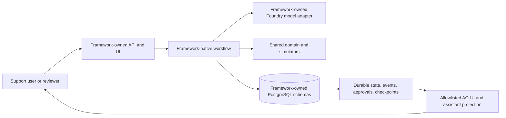
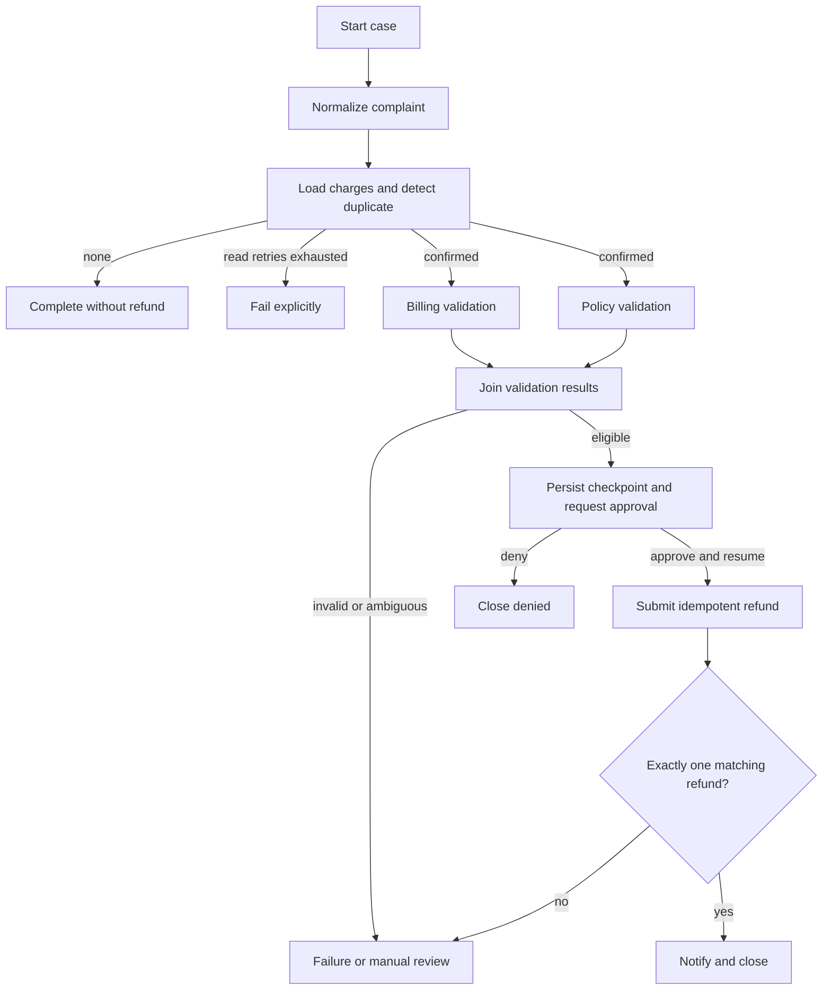

# Architecture

This repository compares two independently implemented agent workflows against one
small, deterministic business domain. It favors visible boundaries over a shared
application platform.

Related documents: [product requirements](prd.md),
[business rules](business-rules.md), [user flow](userflow.md), and
[project structure](projectstructure.md).

## System context



The model may normalize the complaint and draft a customer-facing explanation.
Duplicate detection, policy, approval, refund submission, and verification remain
deterministic.

## Repository ownership

| Area | Owns | Must not own |
|---|---|---|
| `shared/` | Pydantic domain records, enums, fixtures, evaluation contracts, deterministic simulators | APIs, databases, cloud clients, telemetry, framework or runtime code |
| MAF app | MAF workflow, FastAPI API, React UI, persistence, events, model client, tests and placeholders | LangGraph code |
| LangGraph app | `StateGraph`, FastAPI API, React UI, persistence, events, model adapter, tests and placeholders | MAF code |
| Root | Teaching docs and one local PostgreSQL dependency | Shared application runtime or deployment layer |

Neither application imports the other. They share business values and fixture
expectations, not orchestration, API, UI, persistence, telemetry, or deployment
abstractions.

## Workflow architecture



MAF expresses this with its native workflow graph, executors, fan-out/fan-in, and
checkpoint handling. LangGraph expresses it with `StateGraph`, conditional routes,
parallel branches, reducers, `interrupt()`, and `Command(resume=...)`.

## Data and durability

One root Compose service supplies PostgreSQL 16 for local development. Schema
ownership remains application-local:

- MAF stores runs, execution events, approvals, outcomes, selected memory, and MAF
  checkpoints in `maf_double_charge`.
- LangGraph stores application audit records in `langgraph_app` and isolates native
  saver tables in `langgraph_checkpoints`.

PostgreSQL is authoritative for application state and audit history. Model context
and UI projections are temporary views. Reading stored events is replay; running from
a checkpoint again is re-execution and may repeat model or tool work.

MAF applies SQL migrations explicitly before either runtime starts. Its repository
opens connections and checks migration history; it does not create or upgrade schema
on startup. The configured MAF schema can differ between local and deployed
environments. The backend cutover starts with empty MAF state and new checkpoint type
paths rather than providing legacy checkpoint readers or converting old records.
Subsequent releases can explicitly update that already-versioned schema's runtime:
the MAF release helper checks complete migration history and checksums read-only
before deployment, with no schema adoption, DDL, or state reset.

## Event and UI boundary

Each backend first records native durable events, then maps allowlisted records to an
additive AG-UI stream. CopilotKit is limited to explaining the selected run. Starting
a case, recording approval, and resuming execution use explicit API commands.
Projection failures must not alter durable workflow state.

The UI may show business evidence, transitions, retries, tool metadata, approval
state, and verification results. It must not expose credentials, raw prompts, hidden
reasoning, unrestricted tool payloads, or raw checkpoint contents.

## Consistency model

Refund calls are at-least-once attempts protected by an idempotency key. The billing
simulator atomically stores one deterministic refund per key and returns it on an
equivalent retry. Each app persists the refund ID and request fingerprint in its own
PostgreSQL schema so reconstruction can recover the same result. Reusing the key for
different refund data is a conflict. A separate verification step must observe
exactly one matching refund before the workflow can claim completion.

## Hosted boundary

Each lane now owns a deployed Azure topology:

```text
public React/nginx Container App
    -> private FastAPI Container App
    -> lane-owned PostgreSQL Flexible Server

Foundry Hosted Agent (Responses 2.0)
    -> the same framework-owned workflow service
    -> the same lane-owned PostgreSQL authority
```

MAF and LangGraph have separate Foundry projects, Hosted Agents, PostgreSQL servers,
ACRs, Container Apps, managed identities, Log Analytics workspaces, and Application
Insights resources. Hosted code runs on Python 3.13; application containers and local
development use Python 3.12. Both deploy `gpt-5.6-sol` version `2026-07-09` with the
Global Standard SKU in `northcentralus`.

The deployments intentionally retain public Foundry/PostgreSQL service access and
Azure-services firewall rules for teaching simplicity. They are not a production
network-security reference.

## Comparison contract

Compare the implementations by running the same fixture and checking the normalized
outcome, business route, approval behavior, idempotency evidence, and ordered audit
history. Framework-local IDs, checkpoint payloads, and internal graph structures are
not expected to match.
