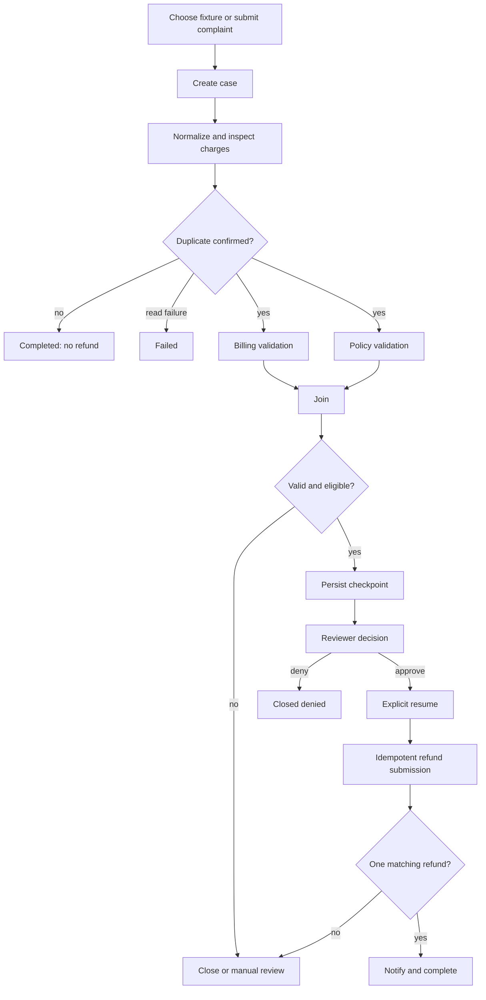

# User flow

Related documents: [product requirements](prd.md),
[business rules](business-rules.md), and
[approval conditions](hitl-approval-conditions.md).

## Support user and reviewer journey

1. A support user selects a fixture or submits a complaint and customer/account data.
2. The application starts a case and displays ordered investigation events.
3. The workflow normalizes the complaint and reads authoritative simulated charges.
4. No matching duplicate closes without refund; exhausted reads fail explicitly.
5. Confirmed evidence fans out to billing and policy validation, then joins.
6. Eligible evidence creates a durable checkpoint and pending approval.
7. A reviewer records approve or deny through an explicit control.
8. Denial closes without refund. Approval is followed by a separate resume command.
9. The resumed workflow submits a refund with the original idempotency key.
10. Exactly one matching refund permits notification and completion; a mismatch
    routes to manual review.

## Interface states

Each framework-owned UI independently presents:

- scenario input and current case/run identifiers;
- graph or timeline progress, selected routes, parallel branches, and joins;
- durable events, tool activity, safe model summaries, and retry attempts;
- pending, recorded, denied, and resumed approval states;
- workflow state, selected memory, durable audit history, and normalized outcome;
- disconnected, malformed-event, retrying, failed, and manual-review states.

The UI observes the durable workflow and calls explicit command endpoints. The
AG-UI/CopilotKit projection cannot start, approve, or resume a case.

The same command boundary is preserved in Foundry Hosted Agents. A JSON `start`
message may pause and return the durable case/checkpoint identifiers. A separate
`approval` message records the reviewer command, and a later `resume` message
continues the checkpoint. Conversation history never substitutes for these explicit
durable commands.
