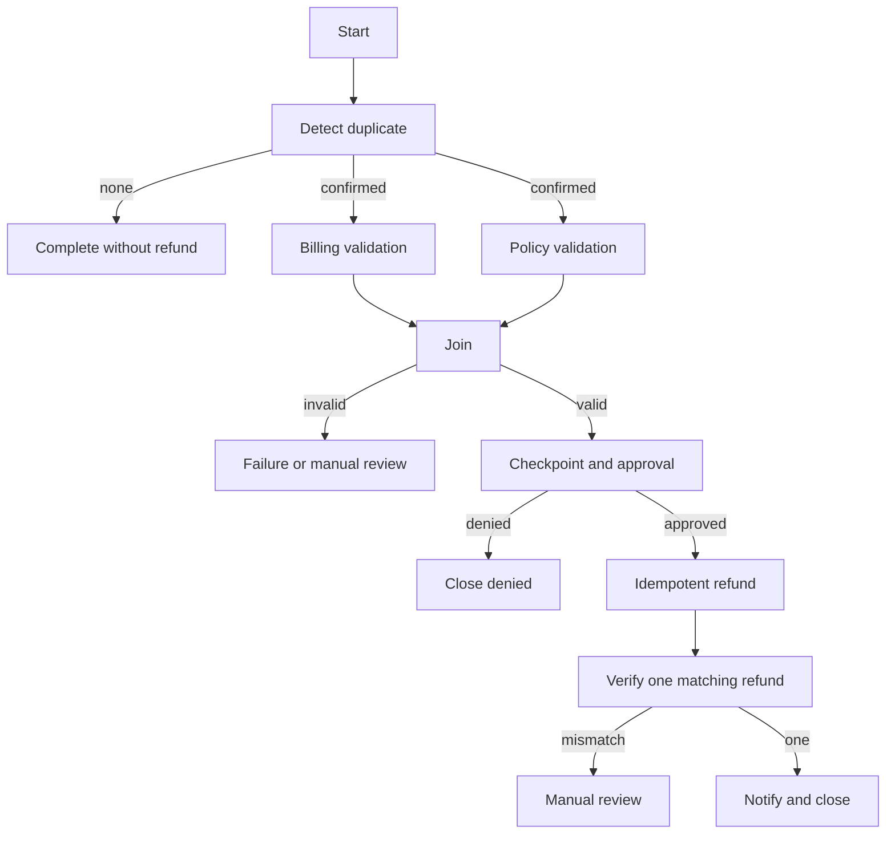

# Double-charge workflow

Canonical detail: [user flow](../design/userflow.md) and
[business rules](../design/business-rules.md).

```mermaid
flowchart TD
    Start --> Detect[Detect duplicate]
    Detect -->|none| NoRefund[Complete without refund]
    Detect -->|confirmed| Billing[Billing validation]
    Detect -->|confirmed| Policy[Policy validation]
    Billing --> Join[Join]
    Policy --> Join
    Join -->|invalid| Failure[Failure or manual review]
    Join -->|valid| Checkpoint[Checkpoint and approval]
    Checkpoint -->|denied| Denied[Close denied]
    Checkpoint -->|approved| Refund[Idempotent refund]
    Refund --> Verify[Verify one matching refund]
    Verify -->|mismatch| Manual[Manual review]
    Verify -->|one| Notify[Notify and close]
```
