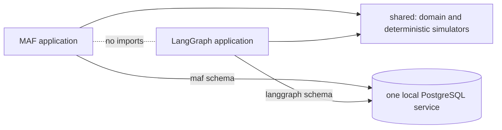

# Repository boundaries

Canonical detail: [architecture](../design/architecture.md) and
[project structure](../design/projectstructure.md).

The root database service is a developer dependency, not shared application
infrastructure. Each application independently owns migrations and repositories.
