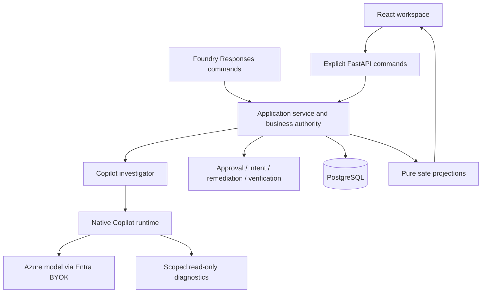

# Architecture: independent Copilot checkout lane

## Logical view

The SDK supplies native model/tool orchestration and conversation management.
Application policy, not the model, decides permitted remediation. API and Hosted
transports invoke the same lane-owned service. No imports from MAF or the POC.

## Process view

Start locks the case identity, checks replay/conflict, runs bounded read-only
investigation, and persists the result. Approval-required cases return a durable
pause, releasing request resources. Approval records a decision; Resume separately
validates it, reconciles action intent, performs permitted remediation and verifies.

The application does not replay a model conversation to approve a payment action.
Native session restoration is separate from business recovery. Interrupted model
turn recovery is not an exactly-once guarantee.

Each investigation owns its asynchronous SDK/credential/receiver lifecycle.
Cancellation must stop work and prevent late tool callbacks. Case sessions and
working directories must not share unrelated configuration or content.

The pinned runtime enables native session storage and infinite sessions for
parent and child agents, with default compaction thresholds. Provider bounds are
16,000 prompt tokens and 2,000 output tokens. History restoration and contextual
recall have local evidence; compaction is enabled but has not been explicitly
exercised. The 24-tool limit is enforced before tool execution. New model turns
and retries are counted separately against an aggregate 12-observed-attempt limit
with abort, not a hard pre-request spending cap.

## Development view

`api/` owns transport/authentication; `application/` owns command/query authority;
`sdk/` integrates native Copilot features; `infrastructure/` owns repositories and
telemetry; `projections/` only transforms already-loaded records.

Only domain models, fixtures, simulator behavior and evaluation contracts come
from root `shared/`. UI, persistence, runtime, telemetry and delivery are lane-owned.
See the [source map](projectstructure.md).

## Physical view

Local defaults: API `127.0.0.1:8030`, UI `127.0.0.1:5180`, PostgreSQL
`127.0.0.1:45432`. Compose owns a separate project, network and database volume.

Planned cloud topology: isolated Foundry project/model/Hosted agent, private API,
UI with optional Basic login (temporarily disabled for the demo), PostgreSQL,
registry, identities and monitoring. Actual resource
and release identities belong in the [ledger](issues-changes-fixes.md).

Business records and native framework state use separate tables. Native state
remains SDK-owned: the private JSONB archive stores native files unchanged, with
version/path/size validation shared by audit and restore. Fresh-process restore
does not create a second transcript format. Never expose that state through UI
projections.

A valid native archive is a required investigation completion condition. Capture
failure stops Start before remediation rather than silently losing promised
conversation durability. This does not make the archive business authority:
Approval/Resume still use only durable business records, and model state cannot
authorize an action.
An investigation failure closes the case with `HARNESS_FAILED`; retry after
repair requires a new Start UUID, not Resume of the closed case.

Foundry owns its Hosted telemetry provider. API setup owns its provider. A private
loopback receiver preserves native CLI trace ancestry while filtering attributes.
Native content capture stays off; synthetic diagnostic capture is explicit opt-in.

## Scenarios (+1)

| Scenario | Authority and recovery proof |
| --- | --- |
| Repeat Start after response loss | Same UUID yields the persisted case; conflicting fixture rejected |
| Approval after process restart | Decision binds to persisted case/evidence, not model memory |
| Concurrent Resume | Case lock and immutable intent prevent duplicate remediation |
| Uncertain action response | Reconcile operation identity and simulator evidence |
| Verification mismatch | Preserve explicit non-success outcome |
| Native conversation restore | Fresh runtime receives native files and rebound tools; separately tested |

See [business rules](business-rules.md) and [user flow](userflow.md). Tests with
scripted investigators prove business behavior, not actual Copilot execution.
