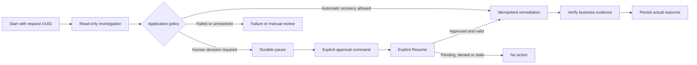

# User flow

The React workspace retains the selected case and pending Start request identity.
An ambiguous Start response retries that same identity. Refresh reloads persisted
case/event/artifact projections without approving or resuming.

The UI presents safe summaries and durable audit events, not raw native session
files, hidden reasoning, system prompts, unrestricted tool payloads or secrets.
Manual review and verification failure are explicit outcomes, not evidence that
another approval button should be enabled.

Conversational continuation is an internal SDK capability, not an additional chat
approval interface.
