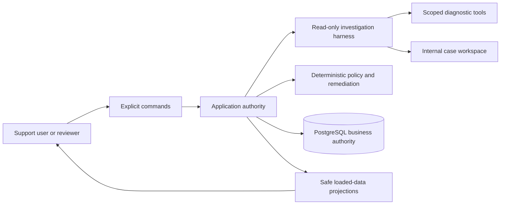

# Architecture

This is the framework-neutral division of responsibilities. The current
[MAF implementation](../maf/docs/design/architecture.md) supplies its own
runtime, service, repository, UI and deployment design.

Each implementation owns its harness integration and framework session/checkpoint
behavior. PostgreSQL owns business state, approval commands, auditing and
verification evidence. A framework checkpoint, model recommendation or UI event
cannot authorize remediation.

The application, not the model's diagnostic tool registry, owns consequential
writes. Alternate transports must use the same lane's application authority,
not introduce a second source of workflow truth. No API, UI, repository,
telemetry or deployment abstraction is shared between implementations.
