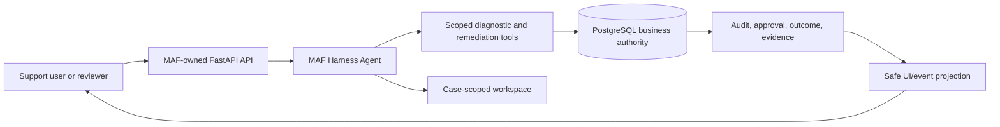

# Architecture

MAF owns the agent harness and its framework session/checkpoint behavior.
PostgreSQL owns checkout business state and auditing. A Foundry Hosted Agent
hosts the same application command service; it does not become a second source
of workflow or business authority.
