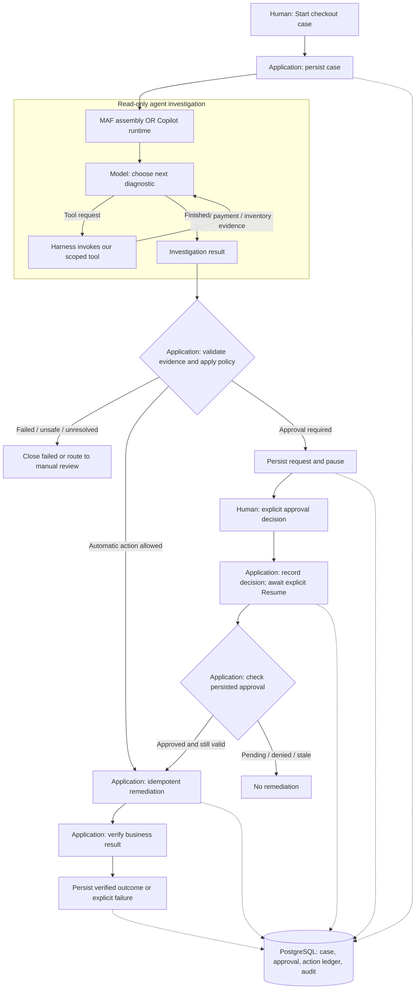

# General-purpose vs managed harness: who owns what?

**Same checkout problem, same business safeguards, different agent engine.**

- **General-purpose framework / custom harness (MAF):** we assemble and configure
  framework primitives.
- **Packaged / managed harness (Copilot SDK):** we configure an existing agent
  runtime and connect our tools.

Both provide a model/tool loop. "Custom" does not mean we write that loop from
scratch; "managed" does not mean the application has no responsibilities.
Here, managed describes the supplied harness, not an all-inclusive hosted service.

## The checkout flow

The model chooses diagnostic steps. The application decides what business action
is permitted. Pausing returns control to the caller; no model call stays open
awaiting approval. Current checkout side effects are deterministic simulations.

## Primitive ownership

**Developer** writes/configures. **Model** proposes. **Agent runtime** orchestrates.
**Application** enforces and persists. **Human** authorizes. **Environment/operator**
supplies compute, identity and storage.

| Primitive | MAF: assemble primitives | Copilot SDK: configure primitives | Application / human boundary |
| --- | --- | --- | --- |
| Model | Configure model client and agent | Configure model/provider for runtime | Developer selects model; environment supplies credentials. Model output is not authority. |
| Agent loop | Framework runs model/tool iterations | Copilot runtime runs model/tool iterations | Application supplies goal, tools and completion checks; does not recreate the loop. |
| Skills and tools | Wire skill, tool, workspace and delegation components | Configure native skills, allowed tools and agent capabilities | Developer supplies checkout knowledge and implements scoped diagnostic tools. |
| Context management | Use supported framework context features and limits | Use native context management and configured compaction | Application selects supported settings; compaction is not lossless business storage. |
| Conversation memory | Framework session state; application connects persistence | Native session history and save/resume | Hosting must preserve required state across replacement; application maps case to session. |
| Preferences / long-term memory | Add/configure appropriate memory components if needed | Enable supported native memory capabilities if needed | Define scope, consent, access and retention. Neither cross-user sharing nor preference memory is implied. |
| Policy | Instructions plus configured framework controls | Instructions plus configured runtime controls | Prompts guide behavior. Deterministic application checks enforce business policy. |
| Permissions | Scope tools and approval callbacks | Restrict native/custom tools and permission handlers | Runtime permission to call a tool is not human authorization to refund. Deny unrelated access. |
| Budget | Configure available execution/context limits | Configure supported runtime/session limits | Application enforces deadlines and tool budgets, accounts for delegation, and handles exhaustion. Context size is not a spending cap. |
| Business rules | Agent investigates within supplied constraints | Agent investigates within supplied constraints | Application enforces refund/reservation rules against durable evidence, not model claims. |
| Side effects | Not exposed through this checkout agent's diagnostic tools | Same proposed diagnostic-only boundary | Application records intent, uses idempotency and verifies the result. Agent retries are not exactly-once execution. |
| Human-in-the-loop | Application pause outside the model loop | Same application pause outside the model loop | Human submits an explicit decision; application persists it and validates a separate Resume command. |
| Environment | Host framework process and dependencies | Host SDK plus Copilot runtime and dependencies | Operator configures identity, secrets, isolation, storage and lifecycle. Hosting does not automatically preserve native sessions. |

**Three different kinds of memory:** conversation history is what the agent has
discussed; preferences are reusable choices; business records are what was
authorized and what actually happened. Neither of the first two replaces the third.

## Four kinds of state: a checkout story

Think of the agent as a detective helping a bank clerk. The detective investigates
the failed checkout, but the clerk and the bank ledger decide whether money can move.

| State | Simple meaning | MAF | Copilot SDK | Analogy |
| --- | --- | --- | --- | --- |
| Conversation | What the agent saw, discussed, and planned | Saves the serialized session and `plan.md`; normal business flow does not restore it | Saves an opaque native session archive and verifies fresh-process restoration | Detective's notebook |
| Agent execution | Where the agent is inside its investigation | MAF runs the configured model, tools, skills, workspace, and child agent in process | A pinned Copilot runtime owns the loop, events, compaction, and child session | Detective's current place in the investigation |
| Business | What is officially true and authorized | PostgreSQL stores the case, approval, remediation intent, idempotency, audit, and outcome | The same responsibilities remain in the independent Copilot application and PostgreSQL schema | Bank ledger |
| Environment | The process, identity, files, dependencies, and tools needed to run | Recreated when the MAF runtime starts | Recreated for each isolated Copilot runtime process | Detective's office and equipment |

A typical case works as follows:

1. **Start:** the application creates the case in PostgreSQL.
2. **Investigate:** the selected harness reads order, payment, and inventory evidence
   and writes a short plan.
3. **Decide:** application policy evaluates the durable evidence. Agent notes do not
   authorize remediation.
4. **Pause:** when approval is required, the application persists
   `WAITING_APPROVAL` and returns control. No model call remains open.
5. **Approve:** a human submits a separate decision that is recorded with its
   reviewer, reason, request identity, and evidence boundary.
6. **Resume:** the application reloads PostgreSQL state, validates the approval,
   performs the idempotent action, verifies it, and records the outcome.

After a process or container replacement, business Resume needs the bank ledger,
not the detective's notebook. Native conversation restoration is useful when the
agent must continue investigating or discussing the case, but it is never proof
that a business action was authorized.

## What exists today versus what is proposed

| Capability | Current checkout MAF | Copilot lane (locally and cloud verified) |
| --- | --- | --- |
| Conversation storage | Saves serialized MAF session plus internal `plan.md` in a separate PostgreSQL table | Native files stored privately as an opaque PostgreSQL archive; fresh-process local restore and actual Azure container-replacement restore verified |
| Business Resume | Reads case/approval/action state; does not restore the MAF conversation or call the model again | Same business boundary, independent of native conversation resume |
| Preferences memory | Not an implemented checkout feature | Not automatically included; enable only for a defined requirement |

The [Copilot lane](../copilot-sdk/) now has its own Foundry v3 deployment,
command/browser E2E, seven native evaluations and linked App Insights traces.
An actual replacement Azure container restored 73 native events from PostgreSQL
without changing the business record. Separate laptop/cloud dependencies resolved
the earlier package-source mistake; see its
[ledger](../copilot-sdk/docs/design/issues-changes-fixes.md). These are this lane's
results, not borrowed POC evidence. Native feature availability still depends on
the selected SDK/runtime; compaction is enabled but not explicitly exercised.

## Boundaries to remember

- **Conversation resume:** continue discussing the case using native agent context.
  **Business Resume:** execute an explicitly authorized workflow step.
- "I remember approval" is not an approval record. A permission prompt is not the
  application's reviewer decision.
- Foundry runs the hosted agent; Copilot manages its agent session. We connect
  durable storage rather than invent a second conversation-history engine.
- Keep native session data private. UI and telemetry expose approved summaries
  and scoped diagnostics, not hidden reasoning or unrestricted session dumps.

## References

- Domain boundaries: [architecture](architecture.md) and
  [human approval](hitl-approval-conditions.md).
- Current MAF: [investigation](../maf/backend/src/checkout_recovery_maf/maf/investigation.py),
  [business service](../maf/backend/src/checkout_recovery_maf/application/service.py),
  [PostgreSQL adapter](../maf/backend/src/checkout_recovery_maf/infrastructure/postgres.py).
- Copilot SDK: [agent loop](https://github.com/github/copilot-sdk/blob/main/docs/features/agent-loop.md),
  [skills](https://github.com/github/copilot-sdk/blob/main/docs/features/skills.md),
  [session persistence and compaction](https://github.com/github/copilot-sdk/blob/main/docs/features/session-persistence.md).
