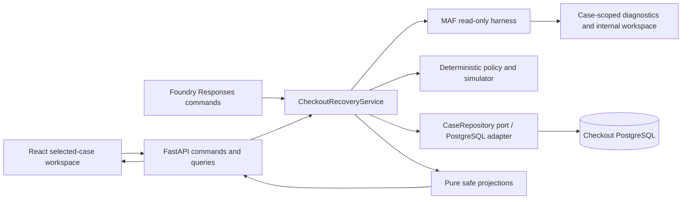
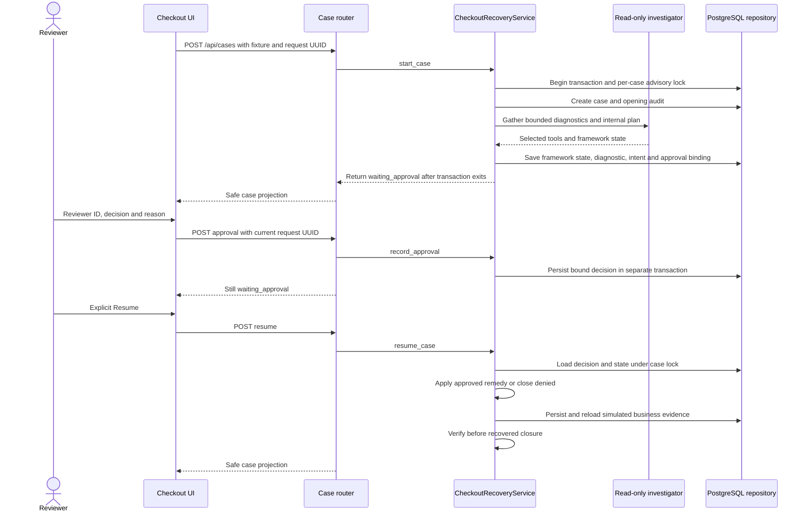
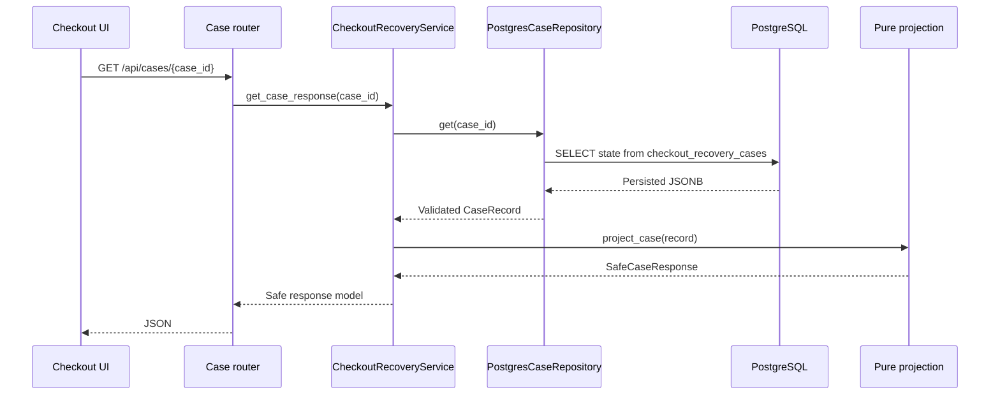
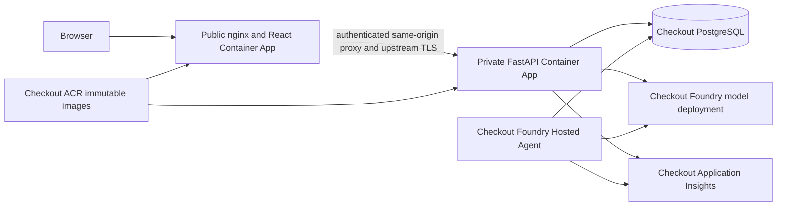

# MAF checkout architecture: 4+1 views

## Purpose and scope

This lane combines an adaptive, read-only MAF investigation with an
application-owned checkout recovery state machine. It independently owns
API, UI, persistence, telemetry, packaging and deployment. The
[neutral contract](../../../docs/README.md) and
[shared domain package](../../../../../shared/) do not contain those mechanisms.

Related: [requirements](prd.md), [business rules](business-rules.md),
[user flow](userflow.md), [stack](techstack.md), [source map](projectstructure.md)
and [dated evidence](issues-changes-fixes.md).

## 1. Logical view

| Responsibility | Owner and boundary |
| --- | --- |
| Host configuration | `config.Settings`; explicit scripted development mode versus required live production configuration. |
| Resource composition | `bootstrap.create_runtime` and `Runtime.start/close`; shared only between checkout's API and Hosted adapter. |
| HTTP transport | `main.py`, `api/app.py`, dependencies and case/health routers; request validation, authentication and safe errors. |
| Commands and queries | `CheckoutRecoveryService`; case lifecycle, approval, intent, remediation, verification and safe query assembly. |
| Investigation | `maf/investigation.py`; bounded MAF harness, triage skill, required diagnostic tools, optional one-time inventory delegation and internal plan. |
| Policy and side effects | Service plus framework-neutral simulator; no business-write tool is registered with the model. |
| Durable authority | `CaseRepository` port and `infrastructure/postgres.py`; synchronous case-scoped transactions and persisted records. |
| Presentation | `projections/safe.py`; immutable allowlisted models and pure transformations of loaded records. |
| Browser state | React selected case, URL and pending request identity; never business authority. |

The service owns the state machine. Unlike double-charge MAF, checkout does
not resume a native MAF workflow checkpoint for human approval. Successful
investigation returns serialized framework session/workspace state for its
separate table; business resume does not read it.

## 2. Process view

### Command flow and durable human pause

This diagram shows the refund path; eligible inventory recovery does not
require approval. Each command holds a synchronous PostgreSQL transaction;
Start includes the investigation before its transaction commits. A human
pause returns and releases resources instead of leaving a transaction or
request waiting for the reviewer.

Equivalent Start, approval and terminal Resume retries recover recorded state.
Uncertain simulated remediation reuses its existing intent, snapshot and
operation identity. These guarantees apply to this persisted simulator:
PostgreSQL does not make an external payment call atomic, and framework retries
are not an exactly-once delivery guarantee.

### Query flow and UI projections

`list_event_responses` similarly loads audit records before `project_event`;
`get_workspace_artifact_response` loads the case before `project_artifact`.
Commands return domain records which their transport projects. Business query
routers do not access repositories directly.

This is command/query separation over one PostgreSQL authority, **not** separate
CQRS databases, projection tables, event sourcing or a new read schema.
Projections perform no SQL, model calls or writes. Three UI GETs are separate
reads and need not share one transaction. UI refresh does not replay commands.

## 3. Development view

`main.py` exports `create_app`; imports do not create an app or open resources.
`api/app.py` owns FastAPI lifespan and authentication. `config.py` resolves
settings; `bootstrap.py` constructs the service, investigator and repository,
opens owned resources on start and closes them on failure or shutdown.
Injected services retain ownership of their resources.

The Hosted adapter constructs the same checkout runtime with `host="hosted"`
and explicit MAF mode. It uses `asyncio.to_thread` for synchronous service and
pool operations. Its JSON protocol accepts Start, approval and Resume, not
arbitrary conversational authorization. The API proxy token is not a Hosted
transport requirement.

Application ports distinguish repository access, investigation and instrumentation. The
PostgreSQL adapter implements the repository port; pure safe projections depend
on application models rather than API request contracts. The service receives a
checkout-owned instrumentation callable instead of importing the infrastructure
exporter. Runtime wiring injects the concrete operation adapter. API and Hosted
dispatch checkout-owned command records; existing public service methods remain
compatible. Readiness is a runtime-health dependency, not a business query.
None of these contracts is shared with another lane.

`backend/migrations/` contains versioned SQL. Migration is an explicit script
operation, not startup DDL. Generated Hosted package trees come from checkout's
canonical backend and the neutral shared package; they are not another editable
implementation. See [source map](projectstructure.md).

## 4. Physical view

### Local and installed execution

The lane-owned [Compose stack](../../compose.yaml) runs only PostgreSQL on
`127.0.0.1:35432` with its own persistent volume and network.
[Local commands](../../README.md#local-postgresql) use the private `.env.compose`
through an explicit wrapper. That wrapper selects the local test database and
scripted mode without changing existing cloud configuration.

The normal documented API is `127.0.0.1:8000`; Vite defaults to port 5173 and
proxies `/api` there. Temporary acceptance used different ports. Editable checkout
`Settings` selects only this lane's `.env`, independent of working directory:
explicit constructor values override process variables, then selected dotenv
values, then defaults. Existing `CHECKOUT_RECOVERY_` keys remain canonical.
Installed and Hosted execution stay environment-only, and `_env_file=None`
isolates tests. `.env.compose` is consumed only by its wrapper. Backend and Vite
launchers honor configured loopback host/ports without copying secrets into the
browser. See [configuration and startup](../configuration.md).

Missing database configuration permits an in-memory development repository.
Production and Hosted require PostgreSQL; live MAF also requires endpoint and
model deployment. A failed live model call never switches to scripted mode.

### Storage and hosted topology

| PostgreSQL table | Responsibility |
| --- | --- |
| `checkout_recovery_cases` | Case/run identities, phase and JSONB business state, simulator snapshot, approval binding and verification outcome. |
| `checkout_recovery_approvals` | Recorded reviewer decision; full binding/reason also lives in case state. |
| `checkout_recovery_remediation_ledger` | Operation identity, fingerprint, action and recorded status. |
| `checkout_recovery_audit_events` | Ordered native audit records with fixed codes and summaries. |
| `checkout_recovery_maf_sessions` | Framework-owned session/workspace serialization, separate from command authority. |
| `checkout_recovery_schema_migrations` | Applied migration identities and checksums. |

The API owns its exporter lifecycle; Hosted keeps Responses SDK telemetry
ownership. Content capture remains disabled. The API exporter now retains every
received span's original trace/span/parent IDs, including native MAF intermediate
parents across batches. Exact allowlisted application names and fixed native
tool/agent/model/unknown categories replace dynamic names; value-validated
attributes and a fixed resource exclude content. Events, links, trace-state,
instrumentation scope and error descriptions are stripped. This is trace-only
configuration, not a logging pipeline. Explicit API connection configuration
overrides the environment; explicit `None` disables setup, while a no-argument
call retains environment lookup. Hosted never calls this setup.
See [telemetry policy and local regression coverage](../../observability/README.md).
The historical three-orphan deployed observation remains recorded in the
[ledger](issues-changes-fixes.md#telemetry-verification-and-retained-limitation);
the local repair is not evidence of a new remote deployment or ingestion result.

Topology is described by [lane infrastructure](../../infra/README.md).
Use the [existing-app image-only release path](../../README.md#delivery)
for app refactors, not a broad foundation redeployment. Hosted direct-code
deployment is separate; verify the downloaded canonical archive, not merely
successful upload. Dated evidence records actual versions and monitoring
connections. This document does not assert ongoing remote health.

## 5. Scenarios (+1)

| Scenario | Observable guarantee | Evidence surface |
| --- | --- | --- |
| Inventory recovery | Deterministic bound and independent verification precede `recovered`. | [Service tests](../../backend/tests/test_service.py) |
| Approval / denial | Decision remains paused until explicit resume; rejected decisions cannot mutate authority. | [API tests](../../backend/tests/test_api.py), service tests |
| Restart / equivalent retry | PostgreSQL decisions, intent and outcomes survive reconstruction. | [Durability tests](../../backend/tests/test_durability.py) |
| Incomplete investigation | Missing evidence/plan or failed bounded invocation cannot trigger business writes. | [Harness tests](../../backend/tests/test_harness_execution.py) |
| Safe case observation | Service-owned reads produce allowlisted case/audit/artifact metadata only. | [Projection tests](../../backend/tests/test_maf_and_projection.py), [architecture tests](../../backend/tests/test_architecture.py) |
| Ambiguous browser Start | Reuse retained request identity instead of duplicating the case. | [Browser tests](../../frontend/e2e/checkout-recovery.spec.ts) |
| Release interruption | Immutable source/image checks retain partial receipts for reconciliation. | [Release guard tests](../../backend/tests/test_release_guards.py), [archive tests](../../backend/tests/test_hosted_archive.py) |

These are intended contracts backed by source/tests. The
[ledger](issues-changes-fixes.md) distinguishes executed acceptance, preserved
failed attempts and remaining limitations.
