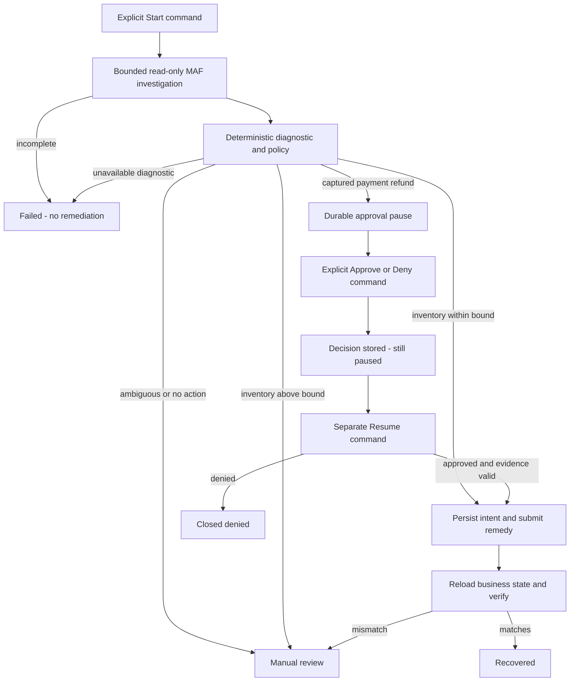

# MAF checkout user flow

## Open, select and observe

The React workspace offers seven fixtures, a selected case's status and
diagnostic evidence, reviewer controls, safe audit history and artifact
metadata. The hosted UI requires its existing demo credentials; credentials
are not part of these documents or the frontend bundle.

Choose a fixture and select **Start case**. The browser creates and retains a
start request UUID before submission. While a command is in flight, controls
are disabled. On a successful response it selects the case in the URL and
reloads case, events and artifact metadata through three safe GET requests.

On an ambiguous start failure, retry the retained request rather than start a
replacement case. The request survives refresh through the browser intent
store. Definite rejected commands clear the intent; the service still enforces
identity/fixture conflicts.

## Business path

The fixture-specific paths and actual outcome names are in
[business rules](business-rules.md). The model does not choose an approval
decision or issue the remedy.

## Paused and reopened cases

For a waiting case, enter a reviewer ID and reason and record approval or denial.
The UI refreshes the case but does not automatically resume it. Select
**Resume** separately to apply the durable decision.

Reloading the selected-case URL restores server state. A new API process can
load the same case, decision and simulator snapshot from PostgreSQL. Reopening
is observation, not replay of Start. If approval is still pending, there is no
authorized continuation; terminal cases are already closed.

There is no paginated historical case list in this lane. The URL identifies a
known selected case; it is not a history/search API.

## Updates and failure states

Updates occur after commands, on initial selected-case load and on explicit
refresh. The UI does not subscribe to native SSE, AG-UI or background polling.
Start and Resume are synchronous requests; progress shown while waiting is
not evidence that intermediate database events have been streamed.

`loadCaseWorkspace` reads the case, audit and artifact metadata separately.
They are not a new materialized read model or a transactionally consistent
three-resource snapshot. PostgreSQL remains authoritative if a browser refresh
fails after a business command has already completed.

Audit entries contain fixed safe summaries, not model reasoning. The workspace
artifact panel shows identifier, kind, revision and timestamp, **not** the
internal `plan.md` file. A stored remediation and a verified recovery are
different states; manual review and failed cases must not look recovered.

There is no selected-run assistant/chat panel, approval inferred from text,
CopilotKit surface or double-charge graph visualization.

## Implementation and evidence

[App.tsx](../../frontend/src/App.tsx) owns the workspace and explicit command
handlers. [api.ts](../../frontend/src/api.ts) owns HTTP reads/commands;
[persistence.ts](../../frontend/src/persistence.ts) owns selected-case URLs
and pending start identity. [Browser tests](../../frontend/e2e/checkout-recovery.spec.ts)
exercise all seven fixtures and ambiguous start recovery. Executed local and
deployed results are recorded separately in the [ledger](issues-changes-fixes.md).
